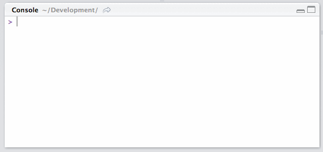
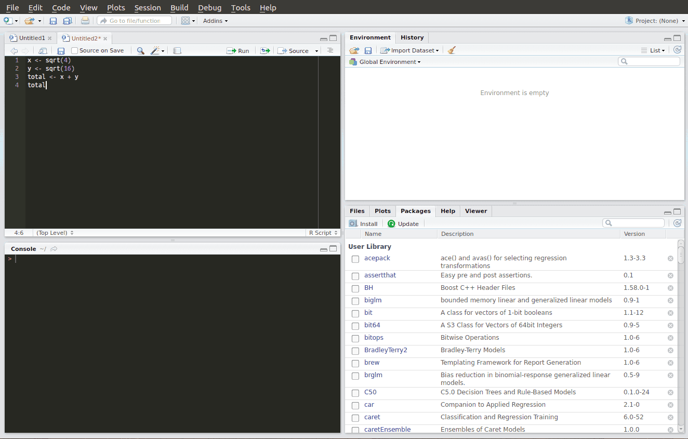

---
output:
  distill::distill_article:
    self_contained: false
description: |
  Seguindo a proposta da sequência *Kit de sobrevivência em R*, vamos aprofundar um pouco mais no funcionamento do R e como fazer uso disso. Nesse post trataremos sobre comandos de console, operações básicas, variáveis, funções, e script R no editor de códigos.
# layout: post
title: "Kit de sobrevivência em R - Parte 2: Operações, Variáveis e Funções"
date: 2016-04-02
# comments: true
# categories: [r, básico, introdução ao r]
# published: true
---

```{r setup, include=FALSE}
knitr::opts_chunk$set(echo = TRUE)
```

<!-- More -->

Como dito no post anterior, o RStudio apresenta 4 janelas principais, cada uma com sua função. No entanto, podemos dizer que as duas janelas que você mais vai usar (no começo) são *Editor de Códigos* e o *Console*. 
	
# Usando o console

Sendo bem simplista, R é uma linguagem que funciona com base em comandos. O console é o lugar onde você digita um comando (uma instrução) e em seguida recebe uma resposta com o resultado. Para quem nunca teve contato com nenhuma outra linguagem de programação, esse simples conceito pode parecer um pouco abstrato. Não há como entendê-lo sem ser praticando.

Observe no console do RStudio que há um símbolo `>`. Esse símbolo indica o lugar onde você vai escrever os seus comandos. Pois bem, clique lá e digite `2*5` em seguida aperte _enter_. Você verá o seguinte:

```{r}
2 * 5
```

O que aconteceu? Você digitou o comando "multiplique 2 vezes 5" no console, e o R respondeu com o resultado 10. E o que é esse `[1]` na resposta do R? Bom, isso significa que o resultado do seu comando só teve uma linha. Em alguns casos o resultado será mais de uma linha, então o R usa essa notação de índices `[x]` para mostrar os resultados do comando. Não se preocupe muito com isso por agora.



# Uma grande calculadora

O R interpreta os seus comandos e dá um resultado apropriado para cada um. Para que os comandos sejam interpretados corretamente, você deve usar os elementos da linguagem. 

Por ser uma linguagem estatística, o R já vem com muitas operações prontas para serem usadas. Por exemplo, todas as operações básicas da matemática. 

Digite os seguintes comandos no console, apertando _enter_ após cada linha, para ver o resultado:

```{r}
5 + 3 
5 - 3 
5 * 3 
5 / 3 
5 ^ 3 
2 ^ (4 - 2) * -8 / (5 * (10 + 3)) #Precedentes matemáticos
``` 

Mas o que é esse `#`? Trata-se de um símbolo indicando um comentário. Um comentário é alguma explicação que você escreve em seus comandos e que o R não interpreta, ou seja, não influencia no resultado final. Serve apenas para documentar, comentar ou explicar alguma parte dos seus comandos.

Reparem que, com o que foi dito até agora, já da pra usar o R como uma grande calculadora de luxo!

>Dica: no console, aperte seta para cima do teclado e você terá os últimos comandos digitados.


# Variáveis

Na maioria dos casos, o trabalho que você precisará fazer vai exigir mais do que uma simples calculadora pode oferecer, será necessário conhecer mais das possibilidades do R. 

A estrutura mais básica que você irá utilizar é chamada *variável*. Mais uma vez, buscando ser simplista, variável nada mais é do que um pequeno espaço na memória do seu computador onde você armazena o resultado de um comando. E para esse pequeno espaço de memória você define o nome que você quiser!

O uso de variáveis é extremamente útil, pois muito provavelmente você precisará armazenar resultados de comandos para operá-los em conjunto logo em seguida.

Para armazenar uma variável no R, você deve usar o seguinte símbolo `<-`, formando uma setinha direcionada para a esquerda. Você pode chamar suas variáveis do que você quiser! Elas podem conter letras, números, ponto `.`, e _underscore_ `_`, e podem ter o tamanho qualquer tamanho. Há apenas uma regra: o nome das variáveis deve começar com letras (maiúsculas ou minúsculas). Se o R, por algum motivo, for retornar uma variável que tenha o nome iniciando com número, automaticamente será adicionado ``` no início e no fim.

```{r}
minha_PRIMEIRA.variavel <- 9 ^ 10 #Nome esdrúxulo de variável apenas para exemplificar!
```

"Ué, apertei enter e nada aconteceu?". Aconteceu sim! Você colocou o resultado de `9 ^ 10` dentro da variável chamada `minha_PRIMEIRA.variavel`. Para comprovar e para ver o que tem "dentro da variável", digite apenas o nome da variável e aperte enter:

```{r}
minha_PRIMEIRA.variavel
```

Sempre que precisar usar o valor de 9 ^ 10, basta usar sua variável `minha_PRIMEIRA.variavel` e pronto, terá o resultado dessa operação armazenado sem precisar calcular novamente. Você pode fazer diversas operações com as variáveis. Por exemplo:

```{r}
x <- 5 / 2
y <- 3 ^ 2
z <- y - x #Resultado da operação y menos o resultado da operação x
z
```

>Dica: use nomes explicativos! Talvez não pareça muito útil agora, mas existem alguns padrões e boas práticas para escrever comando em R que vai ajudar muito na hora de você mesmo ou outras pessoas entenderem o que foi feito. Recomendamos a leitura de alguns padrões de nomenclatura, [como este aqui](http://adv-r.had.co.nz/Style.html).


```{r}
primeira.variavel <- -5 * 4 #padrão com ponto, mais comum em R
primeiraVariavel <- -5 * 4 #padrão camel case, comum em outras linguagens de programação
primeira_variavel <- -5 * 4 #padrão underscore
```

Pronto, você já sabe usar o console para comandos com os operadores matemáticos básicos e sabe armazenar resultados em variáveis. 


# Funções

Precisaremos mais do que simples variáveis e simples operações matemáticas para usar toda potencialidade do R.

Existem alguns "programas" prontos para uso no R, ou seja, algumas sequências de comandos preparados para serem usados de forma simples e facilitar sua vida. Esses "programas" prontos são chamados de funções, e são usados para tudo que você possa imaginar: cálculos mais complexos, estatística, análise de dados, manipulação de dados, gráficos, relatórios, etc. 

Na verdade, uma das coisas que torna o R uma ótima linguagem estatística é a gigantesca quantidade de funções disponíveis. Para (quase) tudo que você quiser fazer, existe uma função que facilita as coisas. Algumas funções já vem com a instalação base do R, outras você precisa instalar um pacote extra (falaremos disso em breve). 

Uma função tem dois elementos básicos: o nome e o(s) parâmetro(s). Por exemplo, função para cálculo de raiz quadrada:

```{r}
raiz.quadrada <- sqrt(16) 
raiz.quadrada
```

Ou seja, `sqrt` é o nome da função para calcular raiz quadrada, e `16` é o parâmetro que você informa para função calcular. Detalhe: o resultado das funções também podem ser armazenados em variáveis, tal qual demonstra o exemplo.

Um outro exemplo, é a função para arredondar um número:

```{r}    
x <- 5.34999
round(x, 2)
```

Ou seja, `round` é o nome da função para arredondamento. Já o `x`, a variável que armazena `5.34999`, é o primeiro parâmetro, informando o número que você quer arredondar. E temos o `2` como segundo parâmetro, informando até quantas casas decimais você quer arredondar. 

Como dito, a instalação base do R já vem com algumas funções muito utilizadas. Segue [uma](https://stat.ethz.ch/R-manual/R-devel/library/base/html/00Index.html) lista para conhecer melhor cada uma dessas funções básicas. Na sequência de posts apresentaremos pacotes com muito mais funções importantes disponíveis.

# Script.R (editor)

Você agora consegue fazer cálculos básicos, armazenar resultados em variáveis e usar funções para auxiliar nos cálculos. Mas tudo isso usando o console.

O console é extremamente útil para algumas atividades exploratórias, mas, no geral, para trabalhos envolvendo ciência de dados, será necessário escrever um script.

Script nada mais é do que uma sequência de comandos, iguais aos que você escreveria no console, mas escritos em um *arquivo de texto*, de forma que todos eles possam ser executados em um momento único pelo R, e os resultados apresentados de uma vez só.

No console você digita um comando, aperta enter e em seguida recebe o resultado. No editor de texto você digita todos os comandos na sequência que você gostaria, e manda o R executar tudo de uma vez.

Um script é outro conceito abstrato que fica mais fácil de entender praticando.

Deixe o console um pouco de lado agora. Clique em `File > New File > R script`. Procure a janela com o editor de código e escreva o seguinte:

```{r}
x <- sqrt(4)
y <- sqrt(16)
total <- x + y
total
```

Agora clique em `Source`. O que aconteceu? Você não viu o resultado na tela, mas o R executou todo seu script em memória e carregou as variáveis. Para ver o resultado na tela clique em `Source > Source with echo` (ou o atalho ctrl + shift + enter). O resultado do seu script irá aparecer no console. 



Salve o seu script em `File > Save` escolha uma pasta, de um nome e, ao final do nome, escreva `.R`. Pronto. Você criou, executou e salvou um script em R! Você pode abrir esse script sempre que você quiser e executá-lo novamente.

Ao salvar, repare que o formato do arquivo ficou `.R`. Esse é o formato convencionado para scripts em R. 

Foi um longo post, mas finalmente chegamos ao fim! Esperamos que esse post tenha dado uma boa noção de como usar o console com operações e funções básicas, bem como armazenar resultados em variáveis. A partir de agora, salve seus trabalhos em scripts com formato .R e sempre que quiser executá-los use o botão Source. Até a próxima.

##Referências:

* [DataCamp - Free introduction to R](https://www.datacamp.com/courses/free-introduction-to-r)
* [R-introduction](http://www.r-tutor.com/r-introduction)
* [Short R Introduction](https://cran.r-project.org/doc/contrib/Torfs+Brauer-Short-R-Intro.pdf)
* [Working in the Console](https://support.rstudio.com/hc/en-us/articles/200404846-Working-in-the-Console)
* [R Built in functions](http://www.statmethods.net/management/functions.html)
* [Guia de estilo de código - by Hadley Wickham](http://adv-r.had.co.nz/Style.html)
* [Guia de estilo de código - by Google](https://google.github.io/styleguide/Rguide.xml)

## Demais posts da sequência:

* [Kit de sobrevivência em R - Parte 1: Visão Geral e Instalação](https://www.fulljoin.com.br/posts/2016-03-20-kit-de-sobrevivencia-em-r-parte-1)
* [Kit de sobrevivência em R - Parte 2: Operações, Variáveis e Funções](https://www.fulljoin.com.br/posts/2016-03-25-kit-de-sobrevivencia-em-r-parte-2)
* [Kit de sobrevivência em R - Parte 3: Pacotes](https://www.fulljoin.com.br/posts/2016-03-28-kit-de-sobrevivencia-em-r-parte-3)
* [Kit de sobrevivência em R - Parte 4: Carregando Dados](https://www.fulljoin.com.br/posts/2016-04-07-kit-de-sobrevivencia-em-r-parte-4)
* [Kit de sobrevivência em R - Parte 5: Tipos de Dados e Transformações](https://www.fulljoin.com.br/posts/2016-04-21-kit-de-sobrevivencia-em-r-parte-5)
* [Kit de sobrevivência em R - Parte 6: Estruturas de Controle](https://www.fulljoin.com.br/posts/2016-05-01-kit-de-sobrevivencia-em-r-parte-6/)
* [Kit de sobrevivência em R - Parte 7: Avançando e Aprofundando](https://www.fulljoin.com.br/posts/2016-05-09-kit-de-sobrevivencia-em-r-parte-7)

