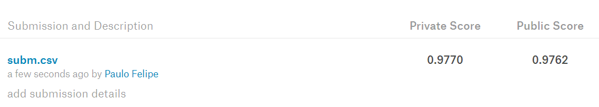

```{r setup, include=FALSE}
knitr::opts_chunk$set(echo = TRUE)
```

## Motivação

A internet é muitas vezes considerada "terra de ninguém". E um dos problemas mais comums são comentários tóxicos, para não usar outro adjetivo. A moderação desses comentários é uma atividade que surge naturalmente. No entando, pode ser inviável analisar individualmente todos comentários de uma grande plataforma, por exemplo.

Nesse sentido, pode ser útil criar um classificador automático. Dessa forma, será exemplificado como criar um classificador no R. Para isso, utilizaremos os dados do desafio do Kaggle [*Toxic Comment Classification*](https://www.kaggle.com/c/jigsaw-toxic-comment-classification-challenge) Iniciaremos, com uma solução mais simples e em outros posts tentaremos utilizar técnicas mais sofisticadas. Uma lista de soluções pode ser encontrada no [fórum da competição](https://www.kaggle.com/c/jigsaw-toxic-comment-classification-challenge/discussion).

## Pacotes

Aqui estão os pacotes que utilizaremos neste post:

```{r}
library(tidyverse)
library(text2vec)
library(purrr)
library(glmnet)
```


## Dados

Os dados podem ser baixados [neste link](https://www.kaggle.com/c/jigsaw-toxic-comment-classification-challenge/data). Precisaremos de três arquivos: `train.csv`, `test.csv` e `test_labels.csv`. O arquivo `test_labels.csv` contém os valores que deveriam ter sido previstos na competição. O Kaggle libera esse arquivo depois que a competição é finalizada. Esse arquivo será útil para avaliarmos o nosso modelo.

```{r}
# Defina aqui o caminho para a pasta que estão os dados
caminho_dados <- 'dados/'
list.files(caminho_dados)
```

Lendo os dados de treinamento:

```{r}
train <- read_csv(file.path(caminho_dados, 'train.csv'))
dim(train)
head(train)
```

O arquivo `train.csv` possui 8 colunas e 159.571 observações. A primeira variável é o id, a coluna `comment_text` traz o texto do comentário e há mais 6 colunas que indicam se comentário foi classificado em uma ou mais categoria de comentário tóxico. 

O que seria um comentário tóxico? Quem quiser pode pular essa parte...Tentei mostrar um comentário mais suave.

```{r}
set.seed(2031)
train %>% 
  filter(toxic == 1) %>% 
  sample_n(1) %>% 
  pull(comment_text)
```


A figura abaixo apresenta a proporção de comentários classificados como "tóxico" por categoria de toxicidade. Uma categoria é denominada de "tóxico", mas estou usando o termo tóxico pra classificar comentário de qualquer uma das categorias.

```{r}
train %>% 
  summarise_if(is.numeric, mean) %>% 
  gather(key = classe, value = proporcao) %>% 
  ggplot(aes(x = classe, y = proporcao)) +
  geom_col(fill = "#F56613F1") +
  scale_y_continuous(labels = scales::percent) +
  theme_minimal() +
  labs(
    title = "Proporção de Comentários Tóxicos por Categoria",
    y = "Proporção",
    x = "Categoria"
  )
```
 O primeiro ponto importante é que existe um desbalanceamento nos dados. Ou seja, a proporção de comentários tóxicos é baixa, principalmente na classe `threat`.
 
## Processando o texto - Bag-of-Words

Precisamos converter os textos dos comentários em variáveis (*features*) que serão utilizadas para treinar o nosso classificador. Uma técnica comum é denominada de bag-of-words, que consiste em criar uma variável para cada palavra do vocabulário e contar quantas vezes aquelas palavra aparece em cada "documento". Também é possível usar n-gramas, que são combinações de n palavras.

Antes, vamos definir uma função que será usada para preprocessar os comentários.

```{r}
limpa_texto <- function(comment){
  tolower(comment) %>% 
    # espaço entre os caracteres especiais
    str_replace_all("([“”¨«»®´·º½¾¿¡§£₤‘’~])", " \\1 ") %>% 
    # espaço entre as pontuações
    str_replace_all("([[:punct:]])", " \\1 ") %>% 
    # substitui quebra de linha
    str_replace_all("\\n", ' ')
}

limpa_texto("teste de processamento!!\n!!")
```

Para fazer a vetorização dos comentários, será utilizado o pacote `text2vec`. O código abaixo cria o vocabulário. A função `space_tokenizer` é utilizada como separador de termos para o dicionário. Além disso, são removidas as chamadas *stopwords*, que são palavras que não adicionam valor na nossa análise.


```{r}

it_train <- itoken(
  train$comment_text,
  preprocessor = limpa_texto,
  tokenizer = word_tokenizer,
  id = train$id,
  progressbar = FALSE
)

vocabulario <- create_vocabulary(it_train,
                                 stopwords = tm::stopwords('en'))
vocabulario
```

O nosso vocabulário possui mais 200.000 palavras. Cada palavra, potencialmente, irá virar uma variável. No entanto, é comum reduzir o vocabulário com o intuito de eficiência. Para reduzir o vocabulário vamos utilizar a função `prune_vocabulary()`. Além da redução de dimensionalidade do problema, palavras que aparecem em quase todos comentários ou quase nunca, dificilmente serão úteis para separar se o post é tóxico ou não. Abaixo fazemos a redução do vocabulário.

```{r}
vocabulario <- prune_vocabulary(
  vocabulary = vocabulario,
  term_count_min = 5,
  doc_proportion_max = 0.9,
  vocab_term_max = 20000
)

vocabulario
```

Por fim, é criado o vetorizador.

```{r}
toxic_vectorizer <- vocab_vectorizer(vocabulary = vocabulario)
```


O vetorizador é usado na função `create_dtm()` para criar nossa matriz de *features*. Como a maioria dos elementos da matriz serão zero, utilizamos o formato `dgCMatrix` para reduzir a necessidade de memória.

```{r}
train_dtm <- create_dtm(
  it = it_train,
  vectorizer = toxic_vectorizer,
  type = 'dgCMatrix'
)

dim(train_dtm)
```
Assim, é criada uma matriz com `r nrow(train_dtm)` linhas (número de comentários) e `r ncol(train_dtm)` colunas (número de variáveis). Essa seria a matriz de *features* que utilizaríamos no nosso modelo.

A técnica de bag-of-words permanece com o problema de simplesmente analisar a frequência de cada palavra em um comentário. Todavia, é preciso considerar que, se uma palavra aparece comumente em muitos comentários, ela não pode agregar muito valor ao modelo. Para atenuar esse problema, usualmente é utilizada uma técnica chamada TF-IDF (*term frequency-inverse document frequency*). Neste método, a frequência de um termo calculada no bag-of-words é multiplicada por um termo denominado idf (*inverse document frequency*). O idf é calculado da seguinte forma:

$$ IDF(t, d) = \log \frac{N_d}{1 + df(d,t)} $$

$N_d$ é o número de documento e $df(d,t)$ é número de documentos em que o termo $t$ aparece. Assim, o valor da variável será calculando multiplicando o número de vezes que a palavra $w$ apareceu do documento $d$ pela quantidade $IDF(t,d)$.

Para calcular a matriz de features utilizando o TF-IDF, é criado um novo objeto e são utilizados os dados de treinamento para calcular os valores necessários e transformar os nossos dados. Mais a frente, iremos aplicar apenas a transformação aos dados de teste.

```{r}
tfidf <- TfIdf$new(
  norm = 'l2'
)

train_dtm_tfidf = fit_transform(train_dtm, tfidf)
```

## Bag-of-Characters

Repetimos o mesmo processo para criar uma *bag-of-characters*. No entanto, vamos usar n-grams que são combinações de n caracters. Utilizamos combinações de 2 a 6 caracteres e limitamos nosso vocabulário em 20.000 termos.

```{r}
it_train_char <- itoken(
  train$comment_text,
  preprocessor = limpa_texto,
  tokenizer = char_tokenizer,
  id = train$id,
  progressbar = FALSE
)

vocabulario_char <- create_vocabulary(it_train_char,
                                      ngram = c(2, 6))

vocabulario_char <- prune_vocabulary(
  vocabulary = vocabulario_char,
  term_count_min = 5,
  doc_proportion_max = 0.9,
  vocab_term_max = 20000
)

toxic_vectorizer_char <- vocab_vectorizer(vocabulary = vocabulario_char)

tfidf_char <- TfIdf$new(
  norm = 'l2'
)

train_dtm_char <- create_dtm(
  it = it_train_char,
  vectorizer = toxic_vectorizer_char,
  type = 'dgCMatrix'
) %>% 
  fit_transform(tfidf_char)

train_dtm_tfidf <- Matrix::cBind(train_dtm_tfidf, train_dtm_char)
```

## Treinando um Classificador

Aqui, iremos treinar um classificador para cada categoria. Será utilizado o modelo *elastic-net* que está disponível no pacote `glmnet`. Basicamente, utilizaremos uma regressão logística com uma regularização que combina penalidades do tipo $l_1$ e $l_2$. Os parâmetros são obtidos resolvendo o seguinte problema:

$$\min_{\beta_0, \beta} \frac{1}{N}\sum_{i=1}^N w_i l(y_i, \beta_0 + \beta^Tx_i) + \lambda[(1-\alpha)||\beta||^2_2 + \alpha||\beta||_1],$$
em que $N$ é o número de observações, $w_i$, $y_i$ e $x_i$ são, respectivamente, o peso, o target e o vetor de features da i-ésima observação. A função $l(.)$ é o negativo do log-likelihood, que depende da distribuição assumida. $\beta_0$, $\beta^T$ são parâmetros que serão estimados. Adicionalmente, $\lambda$ e $\alpha$ são hiperparâmetros que não são obtidos diretamente pela solução do problema. O parâmetro $\lambda$ controla o nível de regularização e o parâmetro $\alpha$ controla a combinação entre os dois tipos de regularização. O parâmetro $\lambda$ será obtido via validação cruzada (5 folds) e o \alpha será fixado em 0.5.

A função abaixo faz o cross-validation e retorna um data.frame com algumas informações, além do modelo treinado.


```{r}
classificador_toxico <- function(categoria, alpha, nfolds = 5){
  
  print(categoria)
  set.seed(303022)
  folds <- train %>% 
    group_by(!!categoria) %>% 
    mutate(fold = sample(1:nfolds, n(), replace = T)) %>% 
    pull(fold)
  
  # Cálculo do peso de cada observação
  # observações como y = 1 entrarão com um peso maior
  data_weights <- ifelse(train[[categoria]] == "1",
                         (1/table(train[[categoria]])[2]) * 0.5,
                         (1/table(train[[categoria]])[1]) * 0.5)
  
  fit <- cv.glmnet(
    x = train_dtm_tfidf,
    y = train[[categoria]],
    family = "binomial",
    alpha = alpha,
    weights = data_weights,
    type.measure = "auc",
    foldid = folds ,
    maxit = 1000
  )
  
  resultado <- tibble(
    categoria = categoria,
    alpha = alpha,
    lambda = fit$lambda.min,
    auc = max(fit$cvm)
  )
  
  list(
    resultado = resultado,
    modelo = fit
  )
}
```

Utilizaremos o pacote `purrr` para criar um classificador para cada categoria e coletar o modelo treinado e os resultados da validação.

```{r}
cv_grid <- expand.grid(
  categoria = c("toxic", "severe_toxic", "obscene",
                "threat", "insult", "identity_hate"),
  alpha = 0.5,
  stringsAsFactors = FALSE
)

resultados_cv <- pmap(
  cv_grid,
  classificador_toxico
)

modelos <- map(resultados_cv, "modelo")
resultados <- map_df(resultados_cv, "resultado") %>% 
  mutate(modelo = modelos) %>% 
  group_by(categoria) %>% 
  filter(auc == max(auc))
```

Aqui, vemos quais foram os melhores valores encontrados de $\lambda$ em termos de AUC (*area under the curve*) que foi a métrica escolhida na competição.

```{r}
resultados %>% 
  select(-modelo) %>% 
  group_by(categoria) %>% 
  filter(auc == max(auc)) %>% 
  knitr::kable()
```

```{r, echo=FALSE}
mean_auc <- resultados %>% 
  group_by(categoria) %>% 
  filter(auc == max(auc)) %>% 
  pull(auc) %>% 
  mean
```

O AUC médio foi de `r mean_auc`.

## Predições para os dados de teste

Por fim, vamos avaliar os modelos treinados na base de teste. Para cada comentário, são realizadas seis predições, uma para cada categoria. O score final será a média do AUC entre todas as categorias.

Aqui, vamos preparar os dados. Os comentários da base de teste serão vetorizados com base no vocabulário da base de treinamento.

```{r}
test <- read_csv('dados/test.csv')

it_test <- itoken(
  test$comment_text,
  preprocessor = limpa_texto,
  tokenizer = word_tokenizer,
  id = test$id,
  progressbar = FALSE
)

it_test_char <- itoken(
  test$comment_text,
  preprocessor = limpa_texto,
  tokenizer = char_tokenizer,
  id = test$id,
  progressbar = FALSE
)

test_dtm_tfidf <- create_dtm(it_test, toxic_vectorizer) %>% 
  transform(tfidf) %>% 
  cbind(.,
        create_dtm(it_test_char, toxic_vectorizer_char) %>% 
  transform(tfidf_char))
```

Abaixo, vemos os dados dos targets na base de teste.

```{r}
test_labels <- read_csv('dados/test_labels.csv')
head(test_labels)
```

Os valores `-1` indicam que aqueles comentários não foram utilizados no cálculo do score final. Dessa forma, teremos que desconsiderá-los na avaliação do modelo.

```{r, echo=FALSE, eval=FALSE}
subm <- test %>% 
    select(id)

for(i in resultados$categoria){
  
  modelo <- resultados %>% 
    filter(categoria == i) %>% 
    pull(modelo)
  
  modelo <- modelo[[1]]$glmnet.fit
  
  # Valor do parâmetro lambda
  lambda <- resultados %>% 
    filter(categoria == i) %>% 
    pull(lambda)
  
  
  # Predições
  pred <- predict(modelo, test_dtm_tfidf, s = lambda, type = "response")[,1]
  
  subm[[i]] <- pred
}
```


```{r}
auc <- c()
for(i in resultados$categoria){
  # recupera o modelo para a categoria i
  modelo <- resultados %>% 
    filter(categoria == i) %>% 
    pull(modelo)
  
  modelo <- modelo[[1]]$glmnet.fit
  
  # Valor do parâmetro lambda
  lambda <- resultados %>% 
    filter(categoria == i) %>% 
    pull(lambda)
  
  # Cria indicador se a observação entra ou não no cálculo do score
  valido <- test_labels[[i]] != -1
  
  # Predições
  pred <- predict(modelo, test_dtm_tfidf, s = lambda, type = "response")[,1]
  
  # Valores observados
  y <- test_labels[[i]]
  
  # Cálculo do AUC
  auc <- c(auc, MLmetrics::AUC(pred[valido], y[valido]))
  
}

names(auc) <- resultados$categoria
auc
```

O AUC médio na base de teste é igual a `r round(mean(auc), 4)`. Este é o nosso resultado! Na plataforma do Kaggle, obtemos os seguintes resultados (ligeiramente diferentes): 



Obviamente, esse resultado não faz cócegas nos resultados obtidos pelos primeiros lugares. No entanto, considerando a classe de modelos lineares, nossos resultados são razoáveis. Inclusive, comparáveis aos resultados dos principais kernel para algoritmos que não está na categoria *deep learning*.

## Próximos Passos

A ideia é apresentar no futuro, para esse mesmo conjunto de dados, resultados utilizando técnicas de deep learning, mas por hoje é só! Espero que o post tenha trazido algo de útil. 
