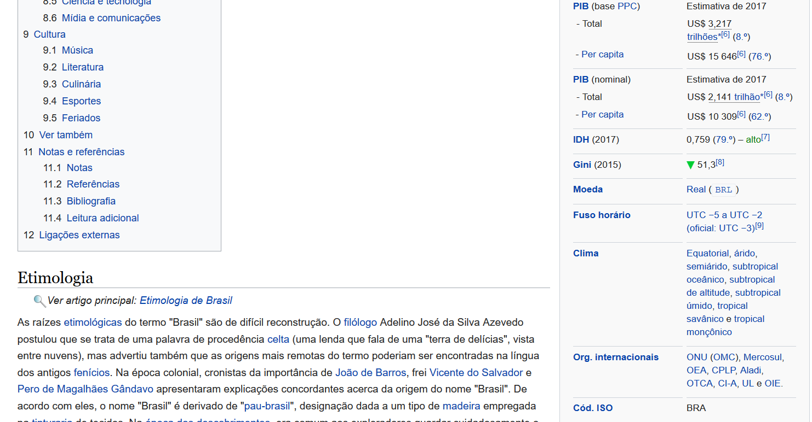
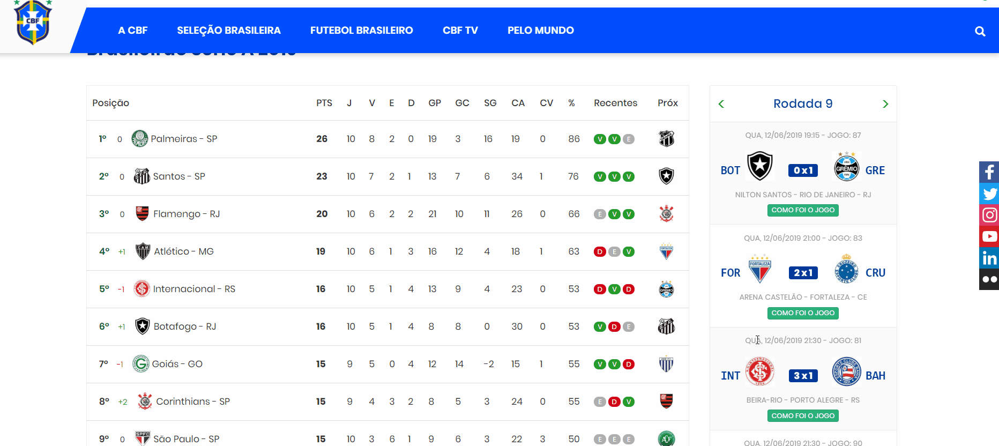

```{r setup, include=FALSE}
knitr::opts_chunk$set(echo = TRUE)
```
<!-- More -->

Além de limpar e organizar dados brutos, parte do nosso trabalho como analista ou cientista de dados também passa pela obtenção dos mesmos. Algumas vezes os dados já estão organizados e disponíveis para download. Mas, em outras ocasiões, embora os dados existam, não há arquivo disponível para download. É o caso dos dados e informações disponíveis nas páginas web, cuja fonte está no formato HTML, um formato não tabular. O conjunto de páginas web é uma mina de dados não tabulares, que, muitas vezes, é deixada de lado pelo desconhecimento da técnica de web scraping. Neste post, discutiremos o assunto e mostraremos como implementá-lo no R por meio do pacote [**rvest**](https://www.rdocumentation.org/packages/rvest/versions/0.3.4).

## O que é web scraping?

É uma técnica de extração de dados de websites de forma automatizada. A web hoje traz inúmeras informações e dados que não estão disponíveis para serem baixados em arquivos estruturados como os arquivos xlsx (excel) ou csv. Como exemplo, podemos ver a página do [Wikipédia sobre o Brasil](https://pt.wikipedia.org/wiki/Brasil). Há uma série de informações e dados ali que não estão organizadas nem disponíveis para download. 

Abaixo podemos ver que o site apresenta dados de PIB (PPC), PIB (nominal), IDH, Índice de Gini, moeda, fuso horário, entre outros dados brasileiros:

```{r, echo = F, fig.align='center'}

```

À primeira vista a extração de dados da web pode parecer mais fácil se feita manualmente, bastando um simples copia e cola. Isso funciona bem quando há poucos dados a serem extraídos. No entanto, à medida que a quantidade de dados para extração aumenta, a tarefa se torna tediosa, sujeita a erros e demorada. 

Imagine ter que extrair do Wikipédia a informação dos presidentes atuais de uma lista de 100 países. Você teria que entrar na respectiva seção do Wikipédia de cada país e extrair essa informação. É algo que não faz sentido se você tem noções de web scraping. Com algumas linhas de código você conseguiria extrair as informações desejadas.

## Como fazemos web scraping com R?

Fazer web scraping com R é bastante intuitivo graças ao pacote [rvest](https://www.rdocumentation.org/packages/rvest/versions/0.3.4). O ideal é conhecer um pouco de HTML para se familiarizar com a estrutura do dado, mas não é requisito necessário ter conhecimentos avançados sobre o assunto como veremos no exemplo a seguir.

## Exemplo: "raspando" dados disponíveis no portal da CBF

Para mostrar como fazer web scraping, escolhemos um caso relativamente simples: vamos extrair dados do portal da [CBF](https://www.cbf.com.br/), o qual traz informações sobre as colocações dos times e resultados dos jogos do Brasileirão.

O objetivo é extrair as informações da coluna interativa lateral direita que apresenta os resultados de cada rodada. A coluna a qual nos referimos pode ser vista abaixo.

```{r, echo = F, fig.align='center'}
knitr::include_graphics('../../images/cbf.gif')
```

Até o momento da publicação deste post, apenas 10 rodadas do Brasileirão haviam sido realizadas. Contudo, veremos que, com o código que será construído, não precisaremos fazer esforço adicional para obter as atualizações dos resultados, uma vez que o mapeamento da estrutura de dados atual também permite mapear a atualização das rodadas futuras (estamos partindo do pressuposto de que a estrutura de HTML do portal da CBF não vai se alterar, pelo menos no curto prazo).

O primeiro passo consiste em carregar os pacotes necessários e puxar as informações HTML do portal da CBF. A função `read_html` se encarrega de trazer os dados HTML para o R. O único que precisamos fazer é passar o link do site na função.

```{r, warning=FALSE, message=FALSE}

library(rvest) # pacote para web scraping
library(tidyverse)

dado_cbf <- read_html("https://www.cbf.com.br")

dado_cbf
```

Para quem não está familiarizado com o formato HTML, a interpretação dos dados extraídos para o objeto `dado_cbf` pode parecer um obstáculo, mas, se tivermos calma para entender o formato, veremos que o entendimento é bastante tranquilo. Na verdade, o que você precisa entender é que qualquer página web é basicamente um texto com formato HTML. As informações estão contidas em tags, que por sua vez podem ter classes. Exemplos de tags são \<head\>, \<body\>, \<div\>, etc. Por sua vez, as classes estão ligadas a uma ou mais tags. Por exemplo, em \<div class="swipe bordas"\> temos a tag `div`, mas também temos duas classes ligadas a essa tag: `swipe` e `bordas`. Deve-se ter cuidado para interpretar as classes. Alguém poderia pensar que se trata de uma classe única chamada `"swipe bordas"`, mas, em HTML, o espaço separa as classes, portanto há duas classes e não uma. Com isso em mente, podemos avançar.

Para iniciarmos a extração de dados, precisamos abrir o portal da CBF e localizar os dados que desejamos "raspar". Neste caso, estamos usando o **Google Chrome**, mas qualquer navegador moderno poderá servir para esta tarefa. 

Depois de localizarmos os dados, clicamos em cima da informação ou do dado desejado com o botão direito do mouse e selecionamos *inspecionar*. Na figura abaixo, clicamos em cima do placar para inspecionar as tags e classes. Observa-se que o placar tem a tag `span` e possui as classes `bg-blue`, `color-white` e `label-2`. Por sua vez, essa tag é englobada diretamente pela tag `strong` com classes `partida-horario` e `center-block`.

```{r, echo=FALSE}

```

Além disso, vamos perceber que entre a abertura e o fechamento da tag `span` temos um texto, que é justamente o placar que foi clicado com o botão direito do mouse. Se você clicar em diferentes placares, notará que as tags junto com as classes se repetem. Estamos observando que há um padrão nos dados HTML. É esse padrão que nos permite extrair dados de maneira automatizada. 

Inspecionar dados HTML pode demorar um pouco até você pegar o jeito, mas, uma vez que você entende a estrutura, fica fácil buscar o dado pela tag e pela classe que você deseja. 

Utilizando a técnica de inspeção de dados, vocês poderão localizar a principal classe de interesse: `swiper-slide`. Essa classe engloba todos os dados com informações das rodadas do Brasileirão. 

Agora utilizamos a função `html_nodes`. No argumento da função pode-se passar uma classe ou uma tag, por exemplo. Para classes, devemos usar um "." antes da classe desejada. Mas, para tags, basta inserir o nome da tag direto na função. Como apenas estamos interessados na classe `swiper-slide`, inserimos o argumento da seguinte forma na função `html_nodes`:


```{r,}

dado_cbf <- dado_cbf %>% 
  html_nodes(".swiper-slide")

print(dado_cbf)
```

Agora estamos vendo que o objeto `dado_cbf` possui uma sequência de linhas com várias tags do tipo `div` com classe `swiper-slide`. Cada uma dessas tags se relaciona com a coluna interativa de resultados do portal da CBF. Assim, explorando cada `div`, podemos extrair as informações desejadas. Por exemplo, ao explorar o HTML, vocês notarão que a tag com classe `swiper-slide` engloba a tag com classe `aside-header` que engloba a tag com classe `text-center` que nos leva a uma informação do número da rodada analisada. Vejamos:

```{r}
rodada <- dado_cbf %>% 
  html_nodes(".aside-header .text-center") %>% 
  html_text()

print(rodada)
```

Também é possível notar que a tag da classe `aside-content` engloba a tag da classe `clearfix`, a qual captura informações de cada jogo (como os times que jogaram e o placar do jogo). Por sua vez, a partir das informações capturadas para cada jogo de uma rodada, observa-se que a tag da classe `pull-left` engloba a tag da classe `time-sigla`, a qual traz informações textuais da sigla do time da casa. Para extrair a sigla do time que joga fora de casa, uma lógica semelhante pode ser usando a classe `pull-right` e a classe `time-sigla`. Por fim, também extraímos os placares identificando a classe correspondente `partida-horario`. Note que não precisamos mapear a tag diretamente ligada ao placar, mas poderíamos fazê-lo sem nenhum problema se quiséssemos. Ao encontrar as tags que possuem as informações desejadas, basta aplicar a função `html_text` para fazer a extração do texto desejado.

```{r}

resultados <- dado_cbf %>% 
  html_nodes(".aside-content .clearfix")

casa <- resultados %>% 
  html_nodes(".pull-left .time-sigla") %>% 
  html_text()

fora_casa <- resultados %>% 
  html_nodes(".pull-right .time-sigla") %>% 
  html_text()

placar <- resultados %>% 
  html_nodes(".partida-horario") %>% 
  html_text() %>% 
  str_extract("[0-9]{1}\ x\ [0-9]{1}")
```

Com algumas linhas de código extraímos informações do site da CBF de forma simples e rápida. O scraping é basicamente isso. Depois de "raspar" os dados podemos, finalmente, estruturá-los. Vejamos:

```{r}
rodada <- 0:(length(placar)-1) %/% 10 + 1

df <- data.frame(rodada = rodada,
           casa = casa, 
           fora_casa = fora_casa,
           placar = placar,
           stringsAsFactors = FALSE) %>% 
  filter(rodada <= 10)

rmarkdown::paged_table(df)
```


