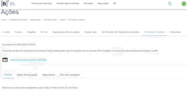
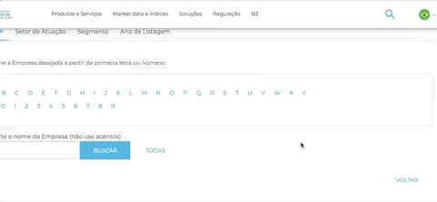
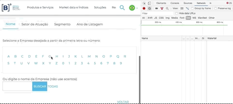
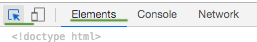
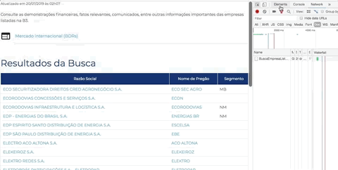
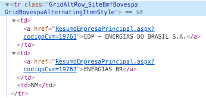
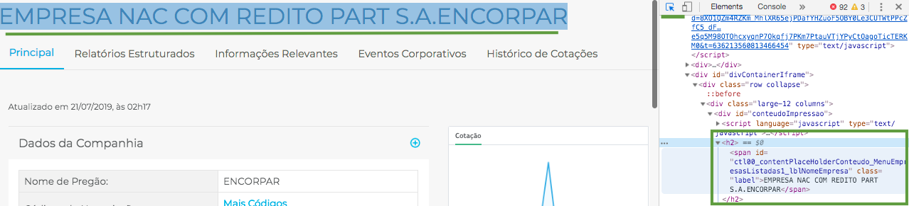
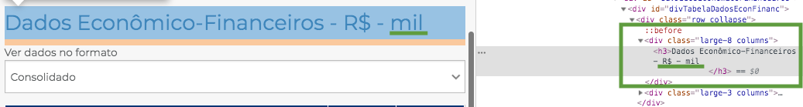

```{r setup, include=FALSE}
knitr::opts_chunk$set(echo = TRUE, cache = FALSE, warning = FALSE, message = FALSE)
```

## DISCLAIMER

**NADA** aqui pode ser interpretado como sugestão de investimento, dica de mercado ou coisa do tipo, pelo contrário! O foco é totalmente em como extrair o dado e trabalhar com ele no R, todos os comentários sobre o assunto mercado financeiro serão simplesmente para contextualizar os dados. 

## Definindo objetivo 

Como objetivo a ser alcançado nesse post, gostaríamos de ter um panorama geral das empresas listadas na bolsa de valores brasileira, bem como seus setores, e entender um pouco mais sobre valores agregados desse cenário para tentar tirar alguns insights.

## Achando a fonte de dados

Na busca por informações e fontes de estudos, me deparei com muitos sites legais e muito conteúdo. Porém, acho muito importante saber consultar dados diretamente na origem, na fonte. No Brasil, até onde eu saiba, só temos uma bolsa de valores e é a **[B]³** (antiga Bovespa + BM&F + CETIP): http://www.b3.com.br. São eles os responsáveis por coletar dados das empresas e divulgar ao público.

Encontrei o seguinte link onde são listadas todas as empresas da bolsa e algumas informações econômico-financeiras de cada uma. É aqui que será o nosso ponto de partida: http://www.b3.com.br/pt_br/produtos-e-servicos/negociacao/renda-variavel/empresas-listadas.htm

## Web scraping ou "raspagem dos dados"

Infelizmente não encontrei uma base de dados pronta, csv, excel ou algo que concentre tudo em um lugar só. Mas isso não é necessariamente um problema, pois se está em um site HTML, então é possível extrair uma base de dados.

Temos um post que começa a explicar sobre [Web Scraping com R aqui]($base_url), antes de seguirmos é importante dar uma lida.

Para praticar um bom scraping é importante também entender bem sobre HTML, CSS e protocolo HTTP. Nesse post tentarei cobrir com mais detalhes o "raciocínio geral" para modelar um scraping. Como pré-requisito, deixo algumas leituras recomendadas: 

* *Curso-R* - http://material.curso-r.com/scrape/
* *ScrapeHero* - https://www.scrapehero.com/a-beginners-guide-to-web-scraping-part-1-the-basics/
* *W3 (DOM)* - https://www.w3.org/TR/WD-DOM/introduction.html
* *Khan Academy* - https://pt.khanacademy.org/computing/computer-programming/html-css-js/js-and-the-dom/pt/the-dom-document-object-model

Voltando a lista disponível no site da B3, a partir de uma lista inicial filtrada pela primeira letra da empresa, temos acesso a uma lista de empresas e, em cada link, algumas informações gerais de cada empresa. Vamos tentar explorar esses dados sem se aprofundar em detalhes de balanço, apenas dados gerais por enquanto.

{ width=75 }

Para uma extração generalizada, a sua rotina de scraping deve reproduzir de forma massiva o comportamento que você mesmo faria se estivesse clicando com o mouse: clicar na letra para listar as empresas, clicar na empresa específica, copiar as informações desejadas da página específica e colar em uma planilha. Reproduziremos esse comportamento no R. Comecemos carregando alguns pacotes

```{r}
library(tidyverse)
library(rvest)
library(glue) # EXCELENTE pacote para colar variáveis a strings!
library(ggplot2)
```

## Identificando links e urls

Uma das primeiras coisas antes de modelar o scraping é tentar entender as dinâmicas das chamadas, urls, clicks, etc.

A má notícia é que o site da B3 é meio bagunçado. Eles fazem uso intenso de [iframes](https://pt.stackoverflow.com/.../por-que-o-uso-de-frames-e-iframes-é-considerado-um...), que é uma antiga e péssima prática de construção de sites. Além disso, fazem um uso não padronizado de urls internas com diferentes domínios, que também é uma péssima prática. É como se estivessem tentando aproveitar sites antigos em uma "casca" nova. Isso dificulta bastante o trabalho de scraping, mas não é um obstáculo intransponível.

Ao clicar em uma letra ou empresa específica você vai reparar que a URL em seu browser não muda. Esse efeito acontece (dentre outras razões) pois eles estão usando um iframe, um espaço dentro da página que na verdade está carregando outra página.

_Uma dica para identificar isso:_ Abra a ferramenta de desenvolvedor do seu navegador (F12 ou Ctrl + Shift + I - ou Cmd + Opt + I no Mac) > escolha a opção **Network** > escolha a opção Doc 



Em seguida, clique em uma letra. Repare que aparecerá um documento listado na área de network, é o resultado da sua chamada. Repare na "URL Real" onde a requisição foi feita: o domínio é http://bvmf.bmfbovespa.com.br/ e não http://www.b3.com.br como aparece no seu navegador.



A página http://www.b3.com.br/pt_br/produtos-e-servicos/negociacao/renda-variavel/empresas-listadas.htm está "mascarando", por meio de um iframe, a verdadeira página que iremos fazer scraping. Com a ajuda da ferramenta de desenvolvedor (Chrome ou Firefox) você consegue identificar que a verdadeira página que está sendo exibida e respondendo a requisição é: http://bvmf.bmfbovespa.com.br/cias-listadas/empresas-listadas/BuscaEmpresaListada.aspx

Agora que identificamos a página verdadeira, vamos pensar na lógica e no fluxo do scraping:

Vou clicar em cada uma das letras para ver a lista de empresas que começam com aquela letra, em seguida vou clicar em cada empresa e coletar cada uma das informações necessárias. Repito isso para cada letra, para cada empresa e cada informação que desejo coletar. Seria absurdamente trabalhoso fazer isso manualmente.

Vamos começar a preparar a base do nosso scraping:

```{r}
base.url <- 'http://bvmf.bmfbovespa.com.br/' #URL BASE
base.lista.empresas <- glue('{base.url}cias-listadas/empresas-listadas/')
letras <- c(LETTERS, 0:9) #criando vetor de LETRAS e números de 0 a 9

for (i in letras) { #percorrendo meu vetor de LETRAS e números
  listagem <- glue('{base.lista.empresas}BuscaEmpresaListada.aspx?Letra={i}&idioma=pt-br')
  #para cada letra, colei junto da URL e gerei um link completo
  print(listagem)
}
```

Com a ajuda de um loop e do pacote glue, é possível criar um link para cada letra, que é justamente cada página que vamos precisar visitar, letra a letra, para em seguida "clicar" em cada empresa. Com o _glue_ você "cola" uma variável em uma string utilizando as chaves assim `{sua_variavel}`. O pacote glue é bem legal, vale a pena aprender a usar, é bem simples e ajuda bastante (eu prefiro o _glue_ ao clássico _paste_). Sugiro uma rápida leitura em https://glue.tidyverse.org/

## identificando as estruturas de HTML

Ao clicar em uma letra recebemos uma lista de empresas. Agora precisamos pegar o link de cada empresa e preparar uma lista maior ainda, não mais de letras e sim das empresas em si.

Há uma estrutura padrão para links em html. O que temos que fazer é descobrir essa estrutura em nossa página e verificar se está padronizada. Nesse caso específico, o nome de cada empresa está estruturado em uma tabela e felizmente o link está disponível na estrutura padrão de links do HTML.

Abra novamente a ferramenta de desenvolvedor do Chorme (ou Firefox), clique na pequena seta que fica na ponta esquerda superior da ferramenta (seletor de elementos) e em seguida passe o mouse em cima do nome de uma empresa. Observe a ferramenta de desenvolvedor na aba _Elements_. Cada lugar que você passa o mouse a ferramenta te mostra a estrutura daquele ponto em HTML.



Você pode passar o mouse nas estruturas em HTML apresentadas na ferramenta e observar a lista de empresas com uma parte escura mosrando o equivalente do HTML. Tente se familiarizar com essa dinâmica, é fundamental para criar bons scrapings. Esse artifício nos permitirá identificar as estruturas que buscamos.



O que queremos? O link de cada empresa. A estrutura que procuramos é a seguinte:



Repare nas tags HTML: `<tr>...</tr>` estrutura uma linha de uma tabela, `<td>...</td>` define uma célula em uma linha, e `<a>...<a>` define um link. Repare que nossa tabela com uma lista de empresas tem 3 colunas, ou seja, 3 células. Então precisamos observar 3 sequências `<td>...</td>`, estruturando o equivalente a 3 colunas: Razão Social, Nome de Pregão e Segmento. Mas no momento não quero nenhuma dessas informações, quero apenas o link de cada empresa que vai me levar a página onde contem informações gerais da empresa. Repare que essa informação está no atributo `href` da tag `<a href="..."> ... </a>` que especifica o destino de um link.

No fim das contas o que queremos agora é o conteúdo do atributo href. Vamos obter da seguinte forma (exemplificando com as empresas listadas na letra E):

```{r}
i <- 'E'
links <- glue('{base.lista.empresas}BuscaEmpresaListada.aspx?Letra={i}&idioma=pt-br')%>% 
  read_html() %>% 
  html_nodes('td a') %>% 
  html_attr('href') %>% 
  unique()

glue('{base.lista.empresas}{links}')
```

Basicamente lemos o HTML de uma página com o `read_html()`, pegamos os "nós" com `html_nodes()`, ou seja, as tags na hierarquia seguidas por `<td><a>...</a></td>` e do resultado obtivemos o conteúdo do atributo `href` com `html_httr()`. Como aparecem 2 links em cada tabela (duas colunas: em Razão Social e Nome de Pregão) e os links são os mesmos, ao final usamos `unique` para garantir que teremos apenas um link de cada linha da tabela. 

É possível obter o mesmo resultado com diferentes seleções de elementos HTML, é quase uma escolha pessoal baseada na interpretação da estrutura da página e na criatividade.

Juntando a nossa varredura por cada letra e nossa varredura por cada linha da página pegando o link de cada empresa, teremos o seguinte:

```{r}
links.empresas <- c()
for (i in letras) {
  listagem <- glue('{base.lista.empresas}BuscaEmpresaListada.aspx?Letra={i}&idioma=pt-br')
  
  links <- listagem %>% 
    read_html() %>% 
    html_nodes('td a') %>% 
    html_attr('href') %>% 
    unique()
  
  links.empresas <- c(links.empresas, glue('{base.lista.empresas}{links}'))
}

# amostra
links.empresas[1:3] #primeiros links
links.empresas[231:233] #links do meio
links.empresas[(length(links.empresas)-2):length(links.empresas)] #ultimos links
```

## Coletando a informação alvo e juntando tudo

Tendo o link de cada página de empresa listada, bastaria entrar um a um e coletar a informação desejada e, ao final, juntar tudo em um dataframe.

Nesse modelo de coleta talvez seja interessante testar para alguns alvos aleatórios para ver se o padrão de coleta persiste e depois executar o scraping massivavamente observando se haverá algum erro no processo. Infelizmente o site da B3 apresenta alguns detalhes não padronizados, o que dificulta um pouco o processo. Veremos a seguir.

Primeiro escolhemos uma empresa qualquer:

```{r}
(link <- links.empresas[178])
```

Pegamos o conteúdo da página. Por aqui tive problema de enconding (caracteres desformatados), então precisei especificar o _Latin1_ como enconding de leitura. Mas isso pode variar conforme o ambiente.

```{r}
conteudo <- link %>% 
    read_html(encoding = 'Latin1')

conteudo
```

Queremos o nome da empresa. Com a ajuda do seletor de elementos, facilmente descobrimos o trecho HTML do alvo.


Podemos selecionar pelo _id_ ou pela tag.

```{r}
nome.empresa <- conteudo %>% 
  html_nodes('#ctl00_contentPlaceHolderConteudo_MenuEmpresasListadas1_lblNomeEmpresa') %>% 
  html_text()

nome.empresa

nome.empresa.tag <- conteudo %>% 
  html_nodes('h2') %>% #Opção menos precisa... Será que vai funcionar para todas as páginas?
  html_text()

nome.empresa == nome.empresa.tag
```

Sempre que possível opte por estratégias menos ambíguas e mais precisas. Escolher pelo _id_ de um elemento é certamente mais preciso do que escolher pelo seu tipo de tag. Quando você especifica o padrão do elemento que você quer selecionar em `html_nodes()` você pode especificar diretamente o tipo de elemento ou o _id_ com `#` antes, ou então a classe com `.` antes do nome da classe.

Ao tentar buscar o resto do conteúdo alvo, nos deparamos com mais uma dificuldade: OUTRO IFRAME! Explorando o seletor pela página em busca do resto dos elementos você até vai encontrar os elementos desejados, mas não vai conseguir fazer o _rvest_ buscar diretamente pois o conteúdo na verdade foi carregado de OUTRA página. Talvez exista alguma forma mais simples de lidar com isso, mas ainda não descobri (se souber, nos avise nos comentários!).

Não bastasse 1, estão usando 2 iframes na página. O primeiro é pra alguma coisa de google, o seguindo é o que queremos:
  
```{r}
conteudo %>% #a partir do conteúdo da página
  html_nodes('iframe')
```

No atributo _src_ vamos buscar o endereçamento da página para pegar o conteúdo diretamente de lá. Estão usando [endereçamento relativo](https://pt.stackoverflow.com/questions/2315/diferen%C3%A7a-entre-urls-absolutos-e-relativos-nos-conte%C3%BAdos-da-p%C3%A1gina). Vamos transformar para absoluto e fazer nossa própria chamada:
  
```{r}
conteudo %>% #a partir do conteúdo da página
  html_nodes('iframe') %>% #seleciona a tag iframe
  .[2] %>% #não bastasse 1, são 2 iframes na página, queremos apenas o seguindo
  html_attr('src')
```

Substituindo o *../../* típico de endereçamentos relativos e colocando com nosso `base.url` para fabricar o link real:
  
```{r}
conteudo %>% #a partir do conteúdo da página
  html_nodes('iframe') %>% #seleciona a tag iframe
  .[2] %>% #não bastasse 1, são 2 iframes na página, queremos apenas o seguindo
  html_attr('src') %>% # o atributo src contém a página que foi inserida no iframe
  str_replace_all(., '../../', '') %>% #substituimos o endereçamento relativo
  paste0(base.url, .) 
```

Finalmente agora conseguimos buscar todo o conteúdo da página que está sendo renderizada dentro do iframe:
  
```{r}
conteudo.iframe <- conteudo %>% #a partir do conteúdo da página
  html_nodes('iframe') %>% #seleciona a tag iframe
  .[2] %>% #não bastasse 1, são 2 iframes na página, queremos apenas o seguindo
  html_attr('src') %>% # o atributo src contém a página que foi inserida no iframe
  str_replace_all(., '../../', '') %>% #substituimos o endereçamento relativo
  paste0(base.url, .) %>% #colamos com base.url para criar endereçamento absoluto
  read_html() #finalmente pegamos o conteúdo do iframe!

conteudo.iframe
```

_Obs: se essa parte não ficou muito clara, por favor avise no comentário para eu tentar explicar mais detalhadamente!_

Com o conteúdo do iframe vamos coletar de fato o que precisamos. Vamos escolher algumas informações para alcançarmos nosso objetivo inicial. Que tal o seguinte: 

* Classificação Setorial 
* Patrimônio Líquido
* Lucro (Prejuízo) do Período
* Atividades Operacionais
* Total de Ações. 

Vamos considerar apenas as informações reportadas no último período disponível.

Obteremos os setores da seguinte forma:

```{r}
setores <- conteudo.iframe %>% 
    html_nodes(xpath="//td[contains(., 'Classificação Setorial:')]/following-sibling::td[1]") %>% 
    html_text()

setores
```

Repare que mudei o formato de parâmetro padrão em `html_nodes(xpath='...')`. O padrão é `html_nodes(css='...')`. Há basicamente duas formas de selecionar os elementos HTML: [css selectors](https://www.w3schools.com/cssref/css_selectors.asp) e [xpath](https://www.w3schools.com/xml/xpath_syntax.asp). Ambos formatos são razoavelmente complexos e leva tempo (experiência) para dominar bem seu uso.

Traduzindo o que está escrito em `//td[contains(., 'Classificação Setorial:')]/following-sibling::td[1]`: selecione a primeira tag `td` que aparece logo em seguida de outra tag `td` que tenha em seu conteúdo o texto `Classificação Setorial:`. Ou seja, selecionamos o irmão subsequente da célula que tem o texto `Classificação Setorial`. Para entender melhor sobre as funções hierárquicas do padrão xpath sugiro a seguinte leitura: https://www.w3schools.com/xml/xpath_axes.asp

Lembrando sempre que daria pra extrair essa mesma informação com outro padrão de busca. Vai da sua experiência e estilo de trabalho!

Obtemos o patrimônio líquido da seguinte forma:

```{r}
patrimonio.liquido <- conteudo.iframe %>% 
    html_node(xpath=".//td[contains(., 'nio Líquido')]/following-sibling::td[1]") %>%
    html_text()

patrimonio.liquido
```

No exemplo acima, peguei com o texto truncado `nio Líquido` pois o site da B3 te uma bela pegadinha: ora escreve patrimônio com acento circunflexo e ora escreve errado com acento agudo `Património Líquido`. Com o texto truncado eu cubro as duas possibilidades.

Obtemos o lucro líquido da seguinte forma:

```{r}
lucro.liquido <- conteudo.iframe %>% 
    html_node(xpath=".//td[contains(., 'Lucro (Prejuízo) do Período')]/following-sibling::td[1]") %>%
    html_text()

lucro.liquido
```

Obtemos o valor de atividades operacionais da seguinte forma:

```{r}
atividades.operacionais <- conteudo.iframe %>% 
    html_node(xpath=".//td[contains(., 'Atividades Operacionais')]/following-sibling::td[1]") %>%
    html_text()

atividades.operacionais
```

E o total de ação pegamos da seguinte forma:

```{r}
total.acoes <- conteudo.iframe %>% 
    html_node(xpath=".//td[contains(., 'Total de Ações')]/following-sibling::td[1]") %>%
    html_text()

total.acoes
```

Depois de alguns testes par diferentes links notamos mais uma pegadinha: alguns valores estão em múltiplos de MIL e outros em unidade. Para colocar todos no mesmo padrão vamos criar uma flag apontando qual é múltiplo de mil. O texto está na tag `h3` dentro da `div` com _id_ `divDadosEconomicoFinanceiros`. Faremos uma limpada no texto e verificamos se ele acaba em `mil`. Se sim, é porque os números são múltiplos de mil.



Capturamos todo o texto `Dados Econômico-Financeiros - R$ - mil` e, depois de uma limpada, verificamos se termina com a string `mil`.

```{r}
mil <- conteudo.iframe %>% 
    html_nodes('#divDadosEconomicoFinanceiros h3') %>% 
    .[1] %>% 
    html_text() %>% 
    str_replace_all('\\r|\\n', '') %>% 
    trimws() %>% 
    endsWith('mil')
```

Para facilitar, faremos uma funçao com cada parte juntando tudo em um dataframe:

```{r}
extrai_informacoes <- function(link) {
  conteudo <- link %>% 
    read_html(encoding = 'Latin1')
  
  nome.empresa <- conteudo %>% 
    html_nodes('#ctl00_contentPlaceHolderConteudo_MenuEmpresasListadas1_lblNomeEmpresa') %>% 
    html_text()
  
  conteudo.iframe <- conteudo %>% #a partir do conteúdo da página
    html_nodes('iframe') %>% #seleciona a tag iframe
    .[2] %>% #não bastasse 1, são 2 iframes na página, queremos apenas o seguindo
    html_attr('src') %>% # o atributo src contém a página que foi inserida no iframe
    str_replace_all(., '../../', '') %>% #substituimos o endereçamento relativo
    paste0(base.url, .) %>% #colamos com base.url para criar endereçamento absoluto
    read_html() #finalmente pegamos o conteúdo do iframe!

  setores <- conteudo.iframe %>% 
    html_nodes(xpath="//td[contains(., 'Classificação Setorial:')]/following-sibling::td[1]") %>% 
    html_text()

  patrimonio.liquido <- conteudo.iframe %>% 
    html_node(xpath=".//td[contains(., 'nio Líquido')]/following-sibling::td[1]") %>%
    html_text()
  
  lucro.liquido <- conteudo.iframe %>% 
    html_node(xpath=".//td[contains(., 'Lucro (Prejuízo) do Período')]/following-sibling::td[1]") %>%
    html_text()
  
  atividades.operacionais <- conteudo.iframe %>% 
    html_node(xpath=".//td[contains(., 'Atividades Operacionais')]/following-sibling::td[1]") %>%
    html_text()
  
  total.acoes <- conteudo.iframe %>% 
    html_node(xpath=".//td[contains(., 'Total de Ações')]/following-sibling::td[1]") %>%
    html_text()
  
  mil <- conteudo.iframe %>% 
    html_nodes('#divDadosEconomicoFinanceiros h3') %>% 
    .[1] %>% 
    html_text() %>% 
    str_replace_all('\\r|\\n', '') %>% 
    trimws() %>% 
    endsWith('mil')  
 
  resultado <- data.frame(
    nome.empresa, setores, 
    patrimonio.liquido, lucro.liquido,
    atividades.operacionais, total.acoes, mil,
      stringsAsFactors = FALSE) 
  
  return(resultado)
}
```

Vejamos o teste da nossa função para mais alguns casos:

```{r}
extrai_informacoes(links.empresas[273])
extrai_informacoes(links.empresas[388])
extrai_informacoes(links.empresas[132])
```

Agora podemos executar nossa função para todos os links (deve demorar de 5 a 10 minutos pois são diversas chamadas, uma para cada empresa):

```{r echo=TRUE, eval=FALSE}
dados <- data_frame()

for(i in links.empresas) {
  parcial <- extrai_informacoes(i)
  dados <- bind_rows(dados, parcial)
}
```

```{r echo=FALSE, eval=TRUE}
# write_csv(dados, 'dados_cache_b3_parciais.csv')
dados <- read_csv('dados_cache_b3_parciais.csv')
```


Precisamos ter o tanto de linhas igual ao tanto de links que capturamos:

```{r}
nrow(dados) == length(links.empresas)
```

Rápida olhada na estrutura do dataframe final

```{r}
head(dados)
tail(dados)
glimpse(dados)
```

Vamos manipular um pouco para deixar o dataframe perfeito e em seguida trabalhar alguns gráficos. Primeiro vamos separar os setores. Cada empresa tem 3 classificações: Setores, Subsetores e Segmento, sendo o último o nível mais detalhado da classificação.

```{r}
dados <- dados %>% 
  separate(setores, c("setor", "subsetor", "segmento"), sep = '/') %>%
  mutate_at(.vars = vars(starts_with('setor')), .funs = ~trimws(.))

unique(dados$setor)
unique(dados$subsetor)
unique(dados$segmento)
```

Vamos transformar os valores em numéricos. Além disso, vamos transformar o número entre parêntesis em número negativo.

```{r}
dados <- dados %>% 
  mutate_at(.vars = vars(patrimonio.liquido, lucro.liquido, atividades.operacionais, total.acoes),
            .funs = ~str_replace_all(., '\\.|\\)', '')) %>% 
  mutate_at(.vars = vars(patrimonio.liquido, lucro.liquido, atividades.operacionais, total.acoes),
            .funs = ~str_replace_all(., '\\(', '-')) %>% 
  mutate_at(.vars = vars(patrimonio.liquido, lucro.liquido, atividades.operacionais, total.acoes),
            .funs = ~as.numeric(.))

glimpse(dados)
```

```{r}
dados <- dados %>% 
  mutate_at(.vars = vars(patrimonio.liquido, lucro.liquido, atividades.operacionais),
            .funs = function(x) { ifelse(.$mil, x * 1000, x) })

```

Acho que chegamos em uma base de dados satisfatória para uma abordagem inicial! Vamos salvar.

```{r, eval=FALSE}
write_csv(dados, 'empresas_b3_2019-06-30.csv')
```

## Alcançando o objetivo

Construída a base de dados, vamos nos informar para conhecer o cenário atual das ações listadas na B3. Lembrando que pegamos apenas os dados reportados pelas empresas referentes ao período de 01/01/2019 a 30/06/2019.

Quantas empresas temos listadas segundo o próprio site da B3?

```{r}
nrow(dados)
```

Qual empresa com maior patrimônio de cada grande setor?

```{r}
dados %>% 
  group_by(setor) %>% 
  filter(patrimonio.liquido == max(patrimonio.liquido)) %>% 
  ungroup() %>% 
  select(setor, nome.empresa, patrimonio.liquido) %>% 
  arrange(-patrimonio.liquido)
```

Qual a quantidade de empresas listadas por cada grande setor?

```{r}
dados %>% 
  group_by(setor) %>% 
  summarise(quantidade.empresas = n()) %>% 
  arrange(-quantidade.empresas)
```

Para responder mais perguntas e possibilitar uma exploração mais dinâmica, vamos montar um gráfico TreeMap interativo expondo algumas variáveis.

Primeiro vamos comprar os totais por setor para entender como as empresas estão distribuídas. Para o gráfico vamos utilizar o excelente pacote [D3plusR](https://github.com/paulofelipe/D3plusR). Temos um [post sobre esse pacote cuja leitura é obrigatória](https://www.fulljoin.com.br/posts/2017-03-12-introducao-d3plusr/)!

```{r}
library(D3plusR)
```

```{r}
d3plus(data = dados %>% mutate(quantidade = 1),
       type = "tree_map",
       id = c("setor", "subsetor", "segmento", "nome.empresa"),
       width = "100%",
       height = 500) %>% 
  d3plusSize(value = "patrimonio.liquido") %>% 
  d3plusLegend(value = TRUE, order = list(sort = "desc", value = "size")) %>% 
  d3plusColor("setor") %>% 
  d3plusDepth(1) %>% 
  d3plusLabels(value = TRUE, valign = "top") %>% 
  d3plusUi(value = list(list(method = "size",
                             value = list(list(Patrimonio = "patrimonio.liquido"), 
                                          list(Qtd.Empresas = "quantidade"),
                                          list(Qtd.Acoes = "total.acoes"))),
                        list(method = "depth", type = "drop",
                             value = list(list(Setor = 0), 
                                          list(Subsetor = 1),
                                          list(Segmento = 2),
                                          list(Empresa = 3)))))
```

No treemap acima, somamos o total do patrimônio para avaliarmos as proporções, mas é curioso notar que existem empresas com patrimônio líquido negativo. Vamos verificar os  setores separando o total de patrimônio líquido negativo e positivo.

```{r}
library(ggplot2)
```

```{r}
dados %>% 
  mutate(patrimonio = ifelse(patrimonio.liquido > 0, 'positivo', 'negativo')) %>% 
  group_by(setor, patrimonio) %>% 
  summarise(patrimonio.total = sum(patrimonio.liquido)) %>% 
  ungroup() %>% 
  ggplot(aes(x = reorder(setor, patrimonio.total), y = patrimonio.total, fill = patrimonio))+
  geom_bar(stat = "identity")+
  coord_flip() + 
  theme(legend.position = "none") +
  labs(title = "Patrimônio positivo e negativo por setores",
       y = "Patrimônio",
       x = "Setores")

```

Comportamento parecido existe no somatório do lucro líquido dos grandes setores. Faremos o mesmo exercício separando o lucro líquido positivo e o lucro líquido negativo.

```{r}
dados %>% 
  mutate(lucro = ifelse(lucro.liquido > 0, 'positivo', 'negativo')) %>% 
  group_by(setor, lucro) %>% 
  summarise(lucro.total = sum(lucro.liquido)) %>% 
  ungroup() %>% 
  ggplot(aes(x = reorder(setor, lucro.total), y = lucro.total, fill = lucro))+
  geom_bar(stat = "identity") +
  coord_flip() + 
  theme(legend.position = "none") + 
  labs(title = "Lucro e prejuízo por setores",
       y = "Lucro",
       x = "Setores")
```

## Conclusão

Com o R + rvest foi possível raspar alguns dados da B3 e montar um dataframe básico, com isso exploramos minimamente os setores das empresas oferecidas na bolsa de valores brasileira e esboçamos algumas visualizações para começar a interpretar. Muitas outras visualizações e explorações passam a ser possíveis com essa estrutura de scraping. Nos próximos posts desse tema vamos tentar outras abordagens e 