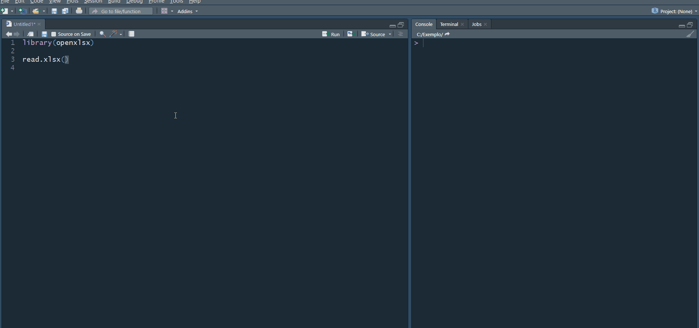
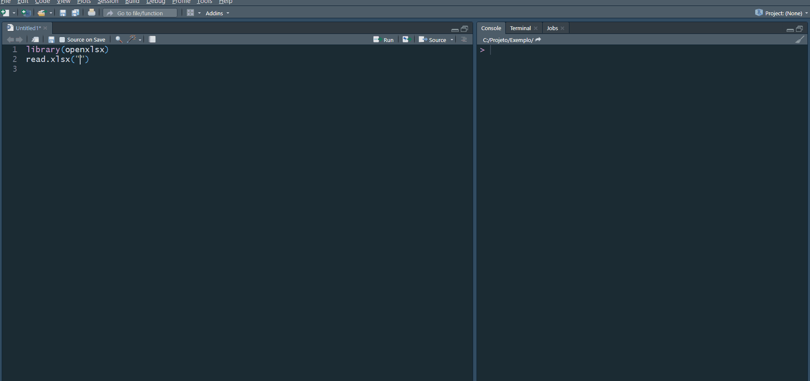
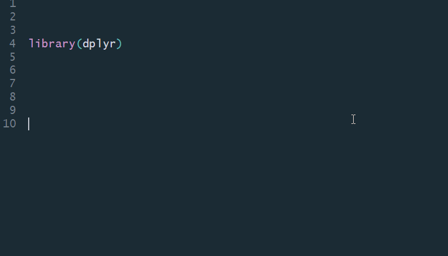

```{r setup, include=FALSE}
knitr::opts_chunk$set(echo = TRUE)
```
<!-- More -->

# Navegue pelo diretório do seu computador de forma interativa

Encontrar a localização de uma pasta ou de um arquivo no seu diretório de trabalho pode ser feito de forma interativa usando o editor de código ou o console do Rstudio. Para navegar de forma interativa, deve-se teclar aspas 2x - "" (2 aspas simples também funcionam - ''). Confirme que o cursor de texto esteja entre as aspas para, em seguida, teclar `tab`. Isso abre um pequeno retângulo de navegação, que lista arquivos e pastas do local onde seu diretório de trabalho está apontado. Pode-se navegar pela lista de arquivos e de pastas com as teclas "para cima" ou "para baixo". Para preenchimento automático da pasta ou do arquivo desejado, pode-se teclar `tab`. Se você tiver selecionado uma pasta, o retângulo de navegação continuará aberto e apresentará a lista de documentos e diretórios dentro da pasta selecionada.

```{r, echo=FALSE}

```

Se você precisar acessar uma pasta acima da qual você se encontra, digite `"../"`. Se precisar acessar duas pastas acima, digite `"../../"` e assim sucessivamente. 

```{r, echo=FALSE}

```

# Autopreenchimento para os argumentos de funções

Há diversas funções na linguagem R e é praticamente impossível decorar os argumentos de todas elas. Nesse aspecto, o Rstudio nos ajuda bastante. Basta digitar o nome da função, abrir parênteses e teclar `ctrl+espaço`. Isso abre um retângulo interativo, que lista todos os argumentos da função escolhida. Também pode-se teclar `tab` em vez de teclar `ctrl+espaço`. No entanto, a tecla `tab` só abre um retângulo interativo se o cursor de texto estiver na mesma linha da abertura da função.

```{r, echo=FALSE}

```

```{r, eval=FALSE}
# tecla tab funciona para listar parâmetros. 
# teclar ctrl + espaço também funciona.
list.files(path = getwd(), all.files = FALSE, recursive = FALSE)

# tecla tab funciona apenas na primeira linha de abertura da função.
# teclar ctrl + espaço funciona em todas as linhas.
list.files(path = getwd(),
           all.files = FALSE,
           recursive = FALSE)
 

```


# Faça um script com os pacotes que você mais usa

Uma prática bastante útil para lidar com a reinstalação de pacotes é criar um script de R com os pacotes que você mais usa. Assim, quando quiser instalar uma nova versão do R ou instalar o R em outra máquina, basta rodar o script de instalação de pacotes que você criou. 
Vejamos abaixo um exemplo de script de instalação de pacotes:

```{r, eval = FALSE}
pacotes <- c("tidyverse", "openxlsx", "data.table",
             "RJDBC", "rjson", "jsonlite",
             "nleqslv", "bigmemory", "fst", 
             "caret", "opera", "forecastHybrid",
             "DT", "checkpoint", "rJava",
             "BB", "kableExtra", "RSQLite", 
             "speedglm", "readtext", "lmtest",
             "bookdown", "devtools", "microbenchmark", 
             "xaringan", "furrr", "randomForest",
             "gbm", "bookdown", "distill")


install.packages(pacotes)

# instala pacotes disponíveis no github
remotes::install_github("thomasp85/patchwork")
remotes::install_github("gadenbuie/xaringanthemer")
```


# Atalhos de teclado convenientes (Windows)

1. O operador de atribuição (`<-`) é certamente um dos operadores mais utilizados no R.  O atalho para o operador é `alt + -` (alt e a tecla menos) .

2. O dplyr é um dos principais pacotes para a manipulação de dados no R e quem o utiliza provavelmente também faz uso constante do operador *pipe* (`%>%`). Para o atalho do pipe, tecle `ctrl+shift+m`.

3. Para comentar várias linhas de uma só vez, selecione as linhas que deseja comentar com o mouse e tecle `ctrl+shift+c`. Para descomentar várias linhas, selecione as linhas comentadas e, novamente, tecle `ctrl+shift+c`.

4. Apague uma linha inteira ou uma seleção de linhas com `ctrl+d`.

5. Rode uma linha ou uma seleção de linhas no editor de código com `ctrl+enter`.


