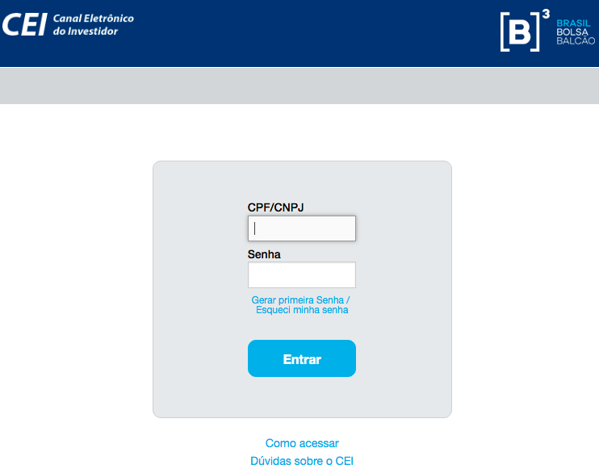
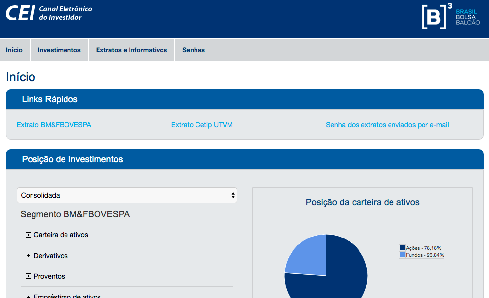
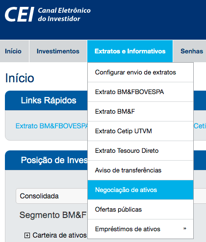

```{r setup, include=FALSE}
knitr::opts_chunk$set(echo = TRUE, cache = FALSE, warning = FALSE, message = FALSE)
```

No post anterior em [B3 + rvest: Explorando dados financeiros com R - parte 1](https://www.fulljoin.com.br/posts/2019-07-18-b3-rvest-explorando-dados-financeiros-com-r/) começamos a explorar, com a ajuda do rvest, alguns dados superficiais sobre a bolsa de valores brasileira. Nesse post vamos explorar o CEI - Canal Eletrônico do Investidor, também da B3, e baixar todo o histórico de compra e venda de ações. 

## Definindo objetivo

Como objetivo a ser alcançado, vamos tentar baixar todo o histórico de compra e venda e montar uma tabela como ponto de partida para uma gestão da própria carteira no R.

## Achando a fonte de dados

Se você investe em renda variável você certamente o faz por meio de uma corretora. A _[B]³_ é a instituição que centraliza toda a gestão das informações e dos contratos, e o CEI é onde o investidor pode ter acesso aos dados direto na fonte.

Dessa vez o ponto de partida da nossa fonte de dados está protegido por usuário e senha no site do CEI em https://cei.b3.com.br/CEI_Responsivo/. Como havia dito, todo investidor pode ter conta no CEI, [aqui eles explicam como fazer isso](https://cei.b3.com.br/CEI_Responsivo/como-acessar.aspx). 

Infelizmente não localizei nenhuma forma rápida de baixar todos os seus próprios dados em formato aberto, csv, json, xml ou algo do tipo. Sendo assim, mais uma vez vamos raspar os dados para o R. O desafio da vez é raspar dados de um site com controle de acesso (usuário e senha). Felizmente o _rvest_ torna essa tarefa um pouco mais fácil.

Vamos usar os seguintes pacotes:

```{r}
library(rvest) # para nossa raspagem
library(tidyverse) # para tudo
library(glue) # para grudar nossas strings
library(keyring)
```

Além dos pacotes clássicos, destaco o pacote [keyring](https://github.com/r-lib/keyring) excelente pacote que ajuda a não ficar escrevendo seu usuário e senha em texto aberto no R. Veremos a seguir.

Mesmo fazendo scraping via R vamos precisar informar nosso usuário (CPF) e senha para acessar o CEI. Considerando que vamos acessar os próprios dados para gerir a própria carteira o pacote keyring atende muito bem. Ao acessar o site https://cei.b3.com.br nos deparamos com a seguinte tela:

{ width=75 }

Comecemos a preparar nosso scraping a partir desta tela. Diferente do post anterior, não vamos começar baixando os dados da tela e sim abrindo uma sessão para simular navegação na parte restrita do site e só depois baixar os dados da tela.

Vamos usar o rvest para simular uma sessão (controle de acesso com autenticação) do browser. Para isso vamos precisar peencher, via R, o usuário e senha do formulário e enviar uma requisição para que os servidores da B3 nos autentiquem e nos mande de volta um cookie. Leia mais sobre sessão, autenticação e cookies em: https://pt.wikipedia.org/wiki/Cookie_(inform%C3%A1tica), https://developer.mozilla.org/pt-BR/docs/Web/HTTP/Cookies ou http://material.curso-r.com/scrape/#sess%C3%B5es-e-cookies

Primeiro criamos uma sessão.

```{r}
url <- 'https://cei.b3.com.br'
sessao <- html_session(url)
```

Por ser uma página de usuário e senha, temos um formulário para preenchermos. Com o `html_form()` podemos pegar os formulários disponíveis na página da sessão que abrimos.

```{r}
(form_login <- html_form(sessao))
```

O retorno é uma lista com o formulário de login. Reparem nos nomes dos campos disponíveis para preenchimento. Temos um `input text` para preencher o usuário (CPF) e um `input password` para preencher a senha. Respetivamente temos `ctl00$ContentPlaceHolder1$txtLogin` e `ctl00$ContentPlaceHolder1$txtSenha` para preencher.

Nesse ponto que usaremos o _keyring_ para não deixar explícito no seu código sua senha de acesso ao CEI. Ele vai ajudar a ocultar suas senhas e usá-las de modo mais seguro. 

Primeiro crie um novo "perfil" no keyring para ele armazenar sua senha de forma criptografada. Vamos chamar de _cei-b3_. Como o keyring vai criptografar suas senhas, você precisa definir uma senha mestra para descriptografar quando quiser. Ele vai pedir uma nova senha mestra para o perfil _cei-b3_. Não é a senha do CEI ainda! A partir de agora, todas as senhas que você armazenar no perfil _cei-b3_ você vai precisar da senha mestra que escolher nesse ponto.

```{r echo=TRUE, eval=FALSE}
keyring_create('cei-b3') # definindo uma senha mestra para armazenamento criptografado
```

Em seguida defina uma entrada para a senha do seu usuário. Você pode definir a entrada que quiser. Vamos definir a entrada *senha* e nosso username será o próprio CPF. No lugar de _12345678900_ coloque seu CPF de verdade. Agora sim o keyring vai solicitar a senha que você vai usar no CEI. 

```{r echo=TRUE, eval=FALSE}
key_set('senha', username = '12345678900', keyring = 'cei-b3')
```

Pronto, você definiu uma senha mestra e definiu a senha do CEI para o seu CPF. Agora vamos retornar ao formulário do CEI e usar a senha de forma mais segura. Basta chamar da seguinte forma:

```{r, echo=FALSE, eval=TRUE}
# keyring_unlock('cei-b3')
form_preenchido <- set_values(form_login[[1]], 
           'ctl00$ContentPlaceHolder1$txtLogin' = key_get('cpf', 'saulo', 'cei-b3'),
           'ctl00$ContentPlaceHolder1$txtSenha' = key_get('senha', 'saulo', 'cei-b3'))
# keyring_lock('cei-b3')
```

```{r, eval=FALSE}
form_preenchido <- set_values(form_login[[1]], 
           'ctl00$ContentPlaceHolder1$txtLogin' = '12345678900',
           'ctl00$ContentPlaceHolder1$txtSenha' = key_get('senha', '12345678900', 'cei-b3'))
```

Com o formulário preenchido vamos simular a submissão dos dados na mesma sessão, seria o mesmo que o "click de entrar". A B3 vai nos autenticar e devolver a página do usuário logado.

```{r}
submit_form(sessao, form_preenchido)
```

Agora estamos na página inicial da área restrita, pós login, já com a sessão autenticada.

{ width=75 }

A página com os dados que queremos raspar se chama Negociação de Ativos. Ao acessar, repare na URL, é ela que iremos usar agora.

{ width=75 }

Como estamos em uma página autenticada com uma sessão, precisamos simular a navegação nesta página sem perder a sessão. Para isso usaremos o _jump_to_ do rvest.

```{r}
url_dados <- glue('{url}/CEI_Responsivo/negociacao-de-ativos.aspx')
pagina_dados <- jump_to(sessao, url_dados)
```

E agora temos mais um formulário a ser preenchido. Temos os seguintes campos para submeter: instituição, conta, data início e data fim. Aqui no meu caso a data início e data fim já vieram preechidos com os períodos disponíveis.

```{r}
(form_dados <- html_form(pagina_dados))
```

No meu caso, abri contas em alguns bancos gratuitos de investimentos para experimentar o serviço deles. Como você pode comprar ações por diferentes bancos, e como queremos montar uma base com todas as ações, independente de corretora/banco, vamos percorrer todos as instituições para coletar todas as ações registradas.

```{r}
instituicoes <- read_html(pagina_dados) %>% 
  html_nodes('option') %>% 
  html_text()

#tirando o placeholder 'Selecione...'
instituicoes <- instituicoes[!grepl("Selecione", instituicoes)] 

instituicoes
```

Agora basta percorrer cada um dos bancos, passando o código do banco e submetendo a consulta na página para regaatar o resultado de cada página e montar um dataframe. Com um simple loop resolvemos isso.

Durante o loop faremos um controle simples para baixar os dados apenas das instituições que apresentam a tabela de compra e venda de ações. As instituições que você nunca comprou apresentam a mensagem "Não foram encontrados resultados para esta pesquisa". Ao detectar a presença dessa frase, vamos assumir que não foi comprada ações nessa instituição. 

As datas e o número de conta são preenchidos automaticamente, basta portanto enviar o código número que aparece na frente do nome de cada instituição.

Ao acessar a página que de fato apresenta os dados, serão exibidas duas tabelas, vamos raspar apenas as informações da tabela com o gigantesco id _ctl00_ContentPlaceHolder1_rptAgenteBolsa_ctl00_rptContaBolsa_ctl00_pnAtivosNegociados_. Dela extrairemos a tag <tabela> e descartaremos a última linha de totais.

O resultado é o seguinte loop:

```{r}
dados_totais <- data.frame()
for(i in instituicoes) {
  #separando o código do banco do nome
  banco <- str_split(i, ' - ', simplify = TRUE)
  numero <- banco[1]
  nome <- banco[2]
  #o formulário espera receber a seleção do código númerico do banco
  form_dados_preenchidos <- set_values(form_dados[[1]], 
                                       'ctl00$ContentPlaceHolder1$ddlAgentes' = numero)

  #submetemos o formulário na mesma sessão logada
  resultado <- submit_form(sessao, form_dados_preenchidos)
  
  #caso não tenha ações, a mensagem será exibida
  nao_teve_resultado <- resultado %>%
    read_html() %>% 
    html_text() %>% 
    str_detect('Não foram encontrados resultados para esta pesquisa')
  
  #caso a mensagem não apareça
  if(!nao_teve_resultado) {
    dados_de_um_banco <- resultado %>% 
      html_nodes('#ctl00_ContentPlaceHolder1_rptAgenteBolsa_ctl00_rptContaBolsa_ctl00_pnAtivosNegociados') %>%
      html_node('table') %>%
      html_table() %>% 
      .[[1]] %>% 
      .[-nrow(.),] #descartando a última linha da tabela por ser um totalizador
    
    dados_de_um_banco$nome_banco <- nome #adicionado nome do banco no dataframe
    
    #bind dos dados de compra e venda de cada banco formando um dataframe total
    dados_totais <- bind_rows(dados_de_um_banco, dados_totais)
  }
}
```

Como estou utilizando meus próprios dados, vou retirar os campos de Valor total e quantidade par questões de segurança.

```{r}
dados_totais <- dados_totais %>% 
  select(-`Valor Total(R$)`, -Quantidade)

glimpse(dados_totais)

head(dados_totais)

tail(dados_totais)
```

### Conclusão

Temos um dataframe com todo nosso histórico de compra e venda de ações de todas as corretoras utilizadas. Com este resutlado poderemos partir para a gestão da carteira, avaliar os rendimentos e fazer um controle bastante detalhado dos seus investimentos em renda variável.

No próximo post deste assunto partiremos deste resultado para fazer algumas análises mais interessantes!

Em breve prepararemos uma função (eventualmente um pacote) com esses processos para facilitar a vida de quem quiser gerir a própria carteira com R.


