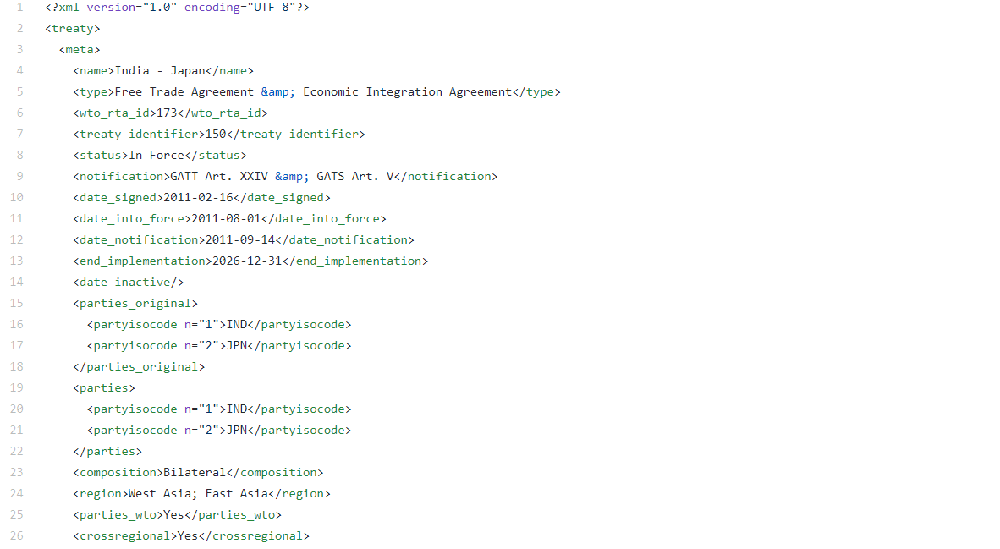

```{r setup, include=FALSE}
knitr::opts_chunk$set(echo = TRUE, fig.height = 5)
```

# Introdução

É bastante comum que uma análise de dados envolva textos. Levando isso em conta, neste post, vamos trabalhar textos no formato *tidy* utilizando o pacote `tidytext`. Após a manipulação de dados, vamos estimar um modelo de tópicos utilizando o pacote `topicmodels`. Esta abordagem permite encontrar diversos "temas" dentro de um conjunto de textos. Este post segue o que está descrito no livro [Tidy Text Mining with R](https://www.tidytextmining.com/) que foi escrito pelos mesmos autores do pacote `tidytext`.

Como aplicação, utilizaremos textos de acordos comerciais da base [*Text of Trade Agreements - TOTA*](http://mappinginvestmenttreaties.com/rta/) desenvolvida pela UNCTAD, que abrange 451 acordos comerciais. Os acordos comerciais celebrados ao redor do mundo notificados à Organização Mundial de Comércio (OMC) possuem um texto que descreve os diversos aspectos que foram negociados e acertados entre os diferentes parceiros. Os acordos comerciais cobrem desde questões tarifárias a questões de propriedade intelectual.

Vamos começar a nossa análise!

# Pacotes

Aqui estão listados os pacotes que utilizamos neste post.

```{r}
library(tidyverse)
library(tidytext)
library(xml2)
library(topicmodels)
library(lubridate)
library(hrbrthemes)
```

A função `theme_set()` define o tema para todos os gráficos do ggplot2.

```{r}
theme_set(
 theme_ipsum() +
   theme(
      legend.position = "top",
      legend.justification = "left"
   )
)
```


# Dados

Os dados estão disponíveis neste link: [https://github.com/mappingtreaties/tota](https://github.com/mappingtreaties/tota).

São 451 arquivos xml com os textos de cada acordo. Por exemplo:



Assim, precisaremos ler cada um deles e convertê-los para data.frame. Dessa forma, vamos primeiro criar um vetor com os caminhos dos arquivos:

```{r}
arquivos_pta <- list.files('xml/', full.names = TRUE)
arquivos_pta[1:3]
```

A função `ler_texto_acordo()` recebe como input o caminho de um arquivo e retorna um data.frame com os dados de um acordo. Cada linha do `data.frame` representa um capítulo do acordo. Na tabela abaixo, o leitor pode dar uma explorada nas variáveis que criamos.

```{r}
ler_texto_acordo <- function(arquivo){
  
  pta <- read_xml(arquivo)
  
  pta_id <- pta %>% 
    xml_find_all("//wto_rta_id") %>% 
    xml_text()
  
  pta_nome <- pta %>% 
    xml_find_all("//name") %>% 
    xml_text()
  
  pta_status <- pta %>% 
    xml_find_all("//status") %>% 
    xml_text()
  
  pta_data_assinatura <- pta %>% 
    xml_find_all("//date_signed") %>% 
    xml_text()
  
  pta_lingua <- pta %>% 
    xml_find_all("//language") %>% 
    xml_text()
  
  capitulos <- pta %>% 
    xml_find_all("//chapter") 
  
  texto_capitulos <- capitulos %>% 
    map(xml_contents) %>% 
    map_chr(~{
      .x %>% 
        map_chr(xml_text) %>% 
        paste0(collapse = " \n ")
    }) 
  
  capitulos %>% 
    map(xml_attrs) %>% 
    map_df(as.list) %>% 
    mutate(
      pta_id = pta_id,
      pta_nome = pta_nome,
      pta_status = pta_status,
      pta_data_assinatura = ymd(pta_data_assinatura),
      id_capitulo = paste0(pta_id, "_", chapter_identifier),
      ano = year(pta_data_assinatura),
      pta_lingua = pta_lingua,
      texto = texto_capitulos
    ) %>% 
    select(contains("pta"), everything())
}


ler_texto_acordo(arquivos_pta[5]) %>% 
  rmarkdown::paged_table()
```

Agora, vamos usar a função `map_df()` para ler todos os arquivos e combiná-los em um único `data.frame`. 

```{r}
pta_df <- map_df(arquivos_pta, ler_texto_acordo)
```

Os acordos podem estar em várias línguas:

```{r}
pta_df %>% 
  select(pta_id, pta_lingua) %>% 
  distinct() %>% 
  count(pta_lingua)
```

Para a nossa análise, vamos nos restringir aos textos que estão em inglês:

```{r}
pta_df <- pta_df %>% 
  filter(pta_lingua == "en")
```

Com a nossa base preparada, vamos checar quantos acordos foram assinados por ano:

```{r}
pta_df %>% 
  select(pta_id, ano) %>%
  distinct() %>% 
  ggplot(aes(x = ano)) +
  geom_bar(fill = "#2980b9") + 
  scale_x_continuous(breaks = seq(1950, 2010, 10)) +
  labs(
    title = "Número de Acordos Comerciais Assinados por Ano",
    subtitle = "Os acordos comerciais se proliferaram a partir da década de 90.
A Organização Mundial de Comércio (OMC) foi criada em 1995.",
    x = "Ano",
    y = "Número de Acordos"
  )
```

# Convertendo os textos para o formato tidy text

Para os autores do pacote `tidytext`, o formato de dados `tidy` para textos seria aquele de uma tabela com uma linha por *token*. Aqui, *token* seria uma unidade de texto relevante (caractere, palavra, parágrafo etc.). Neste post, a nossa unidade será a de palavras. Assim, teremos um data.frame com uma linha para cada palavra de cada documento. Aqui, definimos "documento" como um capítulo de um acordo específico (coluna `id_capitulo`).

Adicionalmente, removemos as chamadas *stop words* com um `anti_join()`. Veja abaixo o que seria esse objeto `stop_words`:

```{r}
head(stop_words, 10)
```

Além das *stop words*, as palavrar que possuem números também são removidas.

```{r}
textos_df <- pta_df %>% 
  unnest_tokens(word, texto) %>% 
  select(id_capitulo, word) %>% 
  anti_join(stop_words) %>% 
  filter(!str_detect(word, "[0-9]"))

dim(textos_df)
head(textos_df)
```

A função `unnest_tokens()` irá quebrar a variável `texto` por palavras. Ao todo, temos `r nrow(textos_df)` palavras. Veja que cada linha agora é uma palavra.

Abaixo é criado um data.frame com as 2000 palavras mais frequentes. As palavras *party* e *parties* são bastante frequentes, mas não trazem nenhuma informação relevante. Dessa forma, elas são removidas da lista de palavras mais frequentes..

```{r}
palavras_frequentes <- textos_df %>% 
  filter(!word %in% c("party", "parties")) %>% 
  count(word) %>% 
  top_n(2000) %>% 
  pull(word)
```


# Modelando tópicos

Com os nossos dados quase prontos, vamos falar sobre o método que será utilizado: Latent Dirichlet Allocation (LDA). O nosso objetivo é encontrar os tópicos que existiriam em uma coleção de documentos. Neste modelo, define-se um quantidade de tópicos $k$ e o algoritmo irá estimar a distribuição de termos ($\beta$) de cada tópico. Esta distribuição traz a probabilidade de ocorrência de uma palavra em um determinado tópico.

Além disso, cada documento é uma mistura de tópicos. Por exemplo, supondo 2 tópicos, o documento 1 é 60% do tópico X e 40% do tópico Y. O que o LDA faz é estimar essas distribuições a partir da frequência de palavras dentro de cada documento.

Para maiores detalhes, ver o [capítulo 6](https://www.tidytextmining.com/topicmodeling.html) e o vignette do `topicmodels` (`vignette("topicmodels")`). 

Para estimar o modelo, é preciso uma matriz de termos por documento. Cada linha dessa matriz é um documento e cada coluna é um termo (uma palavra). O valor em cada posição é a frequência de um termo em um documento. A função `cast_dtm()` converte o data.frame para uma matriz de termos por documento.

```{r}
textos_dtm <- textos_df %>% 
  filter(word %in% palavras_frequentes) %>% 
  group_by(id_capitulo, word) %>% 
  summarise(n = n()) %>% 
  cast_dtm(document = id_capitulo, term = word, value = n)
```

A função abaixo estima o modelo. Além dos dados, definimos arbitrariamente o número de tópicos em 16 e fixamos a *seed* para possibilitar a reprodutibilidade dos resultados.

```{r, echo = FALSE}
#acordos_lda <- LDA(textos_dtm, k = 16, control = list(seed = 9876))
#save(acordos_lda, file = 'acordos_lda.RData')
load('acordos_lda.RData')
```

```{r, echo = TRUE, eval = FALSE}
acordos_lda <- LDA(textos_dtm, k = 16, control = list(seed = 9876))
```

Com o modelo estimado, pode-se extrair o $\beta$, que é a probabilidade estimada de cada termo dentro de um determinado tópico.

```{r}
termos_acordos <- tidy(acordos_lda, type = "beta")
```

Dessa forma, podemos extrair os termos com as maiores probabilidades dentro de cada tópico. Assim, é possível checar se essas palavras indicam sobre qual assunto cada tópico está relacionado. Para quem trabalha no dia a dia com acordos comerciais, deve ser fácil indicar os tópicos. Mesmo não sendo especialista, é possível facilmente identificar que, por exemplo, o tópico 1 refere-se a compras públicas. Já o tópico 7 indica que seja algo relacionado ao tema de propriedade intelectual.

```{r,layout="l-page", fig.height=9, fig.width=8}
#https://stackoverflow.com/questions/28436855/change-the-number-of-breaks-using-facet-grid-in-ggplot2
equal_breaks <- function(n = 3, s = 0.05, ...){
  function(x){
    # rescaling
    d <- s * diff(range(x)) / (1+2*s)
    seq(min(x)+d, max(x)-d, length=n)
  }
}

termos_acordos %>% 
  group_by(topic) %>% 
  top_n(10, beta) %>% 
  ungroup() %>%
  arrange(topic, -beta) %>% 
  mutate(
    term = reorder_within(term, beta, topic),
    topic = paste0("Tópico: ", topic),
    topic = factor(topic, levels = paste0("Tópico: ", 1:16))
  ) %>%
  ggplot(aes(y = term, x = beta, color = topic)) +
  geom_point(size = 2, show.legend = FALSE) +
  geom_segment(
    mapping = aes(yend = term),
    xend = 0,
    linetype = "dotted",
    show.legend = FALSE
  ) +
  facet_wrap(~ topic, scales = "free") +
  scale_y_reordered() +
  scale_x_continuous(
    breaks = equal_breaks(n = 3, s = 0.01),
    labels = scales::number_format(big.mark = ".", decimal.mark = ",", accuracy = 0.01)
  ) +
  labs(
    title = "Principais termos de cada tópico extraído dos textos dos\nacordos comerciais",
    subtitle = "O beta é a probabilidade estimada de um determinado termo ter sido gerado em cada tópico específico.",
    y = "Termo"
  ) +
  theme(
    panel.grid.major.y = element_blank(),
    panel.grid.minor.x = element_blank()
  ) +
  theme_ipsum(
    axis_text_size = 8
  )
```

Também é possível extrair a proporção de cada tópico em cada documento. No nosso caso, um documento refere-se a um capítulo de um acordo. Essa base tem a grande vantagem que a maioria dos capítulos já estão rotulados. A única dificuldade é que existem mais de 900 rótulos diferentes. Muitas vezes, trata-se do mesmo tema, mas com uma escrita diferente. De toda forma, podemos verificar para quais rótulos os nossos tópicos estão associados.

Primeiro vamos extrair a proporção de cada tópico em cada documento:

```{r}
capitulo_topico <- tidy(acordos_lda, matrix = "gamma")
```

Agora, vamos combinar o objeto `capitulo_topico` com o data.frame de acordos (`pta_df`), selecionando as colunas `pta_nome`, `id_capitulo`, `ano` e `name`.

```{r}
capitulo_topico <- capitulo_topico %>% 
  left_join(
    pta_df %>% 
      select(pta_nome, id_capitulo, ano, name),
    by = c("document" = "id_capitulo")
  )
```

Por fim, iremos remover os capítulos que não estão rotulados e vamos extrair o documento que tem a maior proporção de cada tópico. Depois mostramos cada tópico e o rótulo que consta na base de dados dos textos de acordos. O resultado está bem alinhado com o esperaríamos olhando o gráfico anterior. Por exemplo, o tópico 10 claramente refere-se ao tópico de "Defesa Comercial". Na base, o capítulo que tem a maior proporção deste tópico está rotulado como "Safeguard Measures".

```{r}
capitulo_topico %>% 
  filter(!is.na(name)) %>% 
  group_by(topic) %>% 
  filter(gamma == max(gamma)) %>% 
  select(topic, name)
```

Para finalizar a nossa análise, vamos verificar a dinâmica da frequência de acordos que incluíram ou não um capítulo sobre Propriedade Intelectual. Para isso, vamos considerar que um acordo possui um capítulo sobre Propriedade Intelectual se existe algum capítulo com uma proporção desse tópico superior a 50%. Verificamos que esse tema ficou mais relevante após 2005, período que se verifica uma maior frequência de acordos que abrangem esse tema.

```{r, preview=TRUE}
capitulo_topico %>% 
  mutate(ip = topic == 7 & gamma > .5) %>% 
  group_by(pta_nome, ano) %>% 
  summarise(ip = max(ip)) %>% 
  ungroup() %>% 
  count(ano, ip) %>% 
  mutate(ip = ifelse(ip == 1, "Sim", "Não"),
         ip = factor(ip, levels = c("Sim", "Não"))) %>% 
  ggplot(aes(x = ano, y = n, fill = ip)) +
  geom_col() +
  scale_fill_manual(values = c("#e55039", "#b2bec3")) +
  scale_x_continuous(breaks = seq(1950, 2020, 10)) +
  labs(
    title = "Evolução de acordos comerciais identificados com ou
sem tópicos sobre propriedade intelectual",
    x = "Ano",
    y = "Frequência",
    fill = "Acordo com Tópico\nde Propriedade Intelectual?"
  )
```

## Considerações Finais

Neste post, trabalhamos com dados textuais no R e mostramos como é possível estimar um modelo de tópicos. Usamos uma base de dados de textos de acordos comerciais, mas a aplicação pode ser facilmente transferida para outros contextos. 

Existem diversas outras aplicações relacionadas a Processamento de Linguagem Natural que poderão ser apresentadas em outros posts. Hoje, ficamos por aqui! 