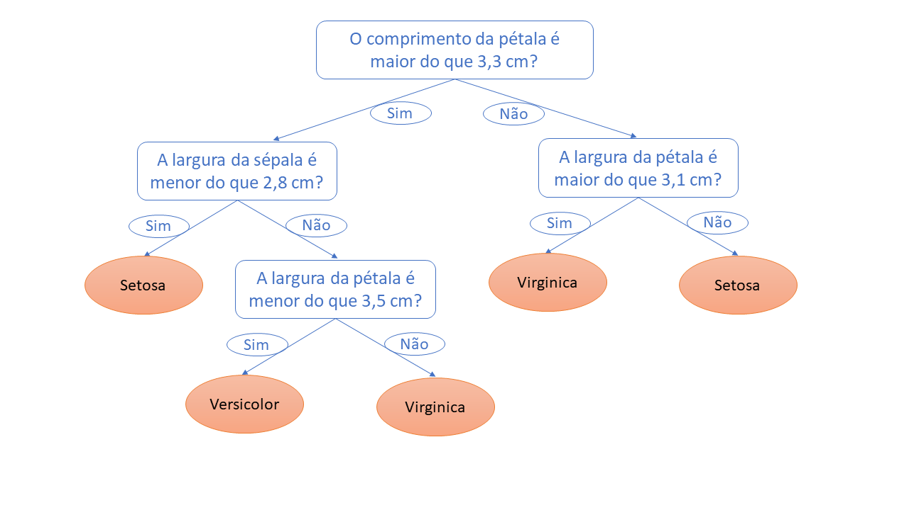

```{r setup, include=FALSE}
knitr::opts_chunk$set(echo = TRUE, warning = FALSE, message = FALSE)
```

No post [Por que evitar for loops em R?](https://www.fulljoin.com.br/posts/2019-09-19-loop-vs-alternativas/) mostramos que for loops são ineficientes em R. Para isso, tal abordagem foi comparada a outras alternativas (funções do `purrr` e da família `apply`), dentre elas opções que usam paralelização. No entanto, no exemplo utilizado, havia um número grande de iterações muito simples, o que não gerou ganho de eficiência nos casos paralelizados. 

Neste post, vamos apresentar um caso em que a paralelização apresenta ganhos de eficiência significativos. Para isso, vamos treinar um modelo *Random Forest* (Floresta Aleatória) de classificação para prever as espécies de flores baseando-se em quatro características: largura e comprimento das pétalas e sépalas. 


## Os dados

Primeiramente, vamos carregar os dados. Não é necessário o uso de nenhum pacote para isso. Basta utilizar o código abaixo.

```{r}

data(iris)

```

Explorando os dados, vemos que existem 150 observações na base de dados. Também, 
notamos que cada uma das espécies aparece a mesma quantidade de vezes, 50 vezes cada. A largura e o comprimento das pétalas e sépalas estão em centímetro. O código abaixo apresenta o resumo dos dados.

```{r}

summary(iris)

```


## Fundamentos introdutórios do *Random Forest*

Como dissemos anteriormente, treinar um modelo de classificação é apenas o meio utilizado para mostrar a utilidade da paralelização. No entanto, já que vamos utilizar o *Random Forest* para isso, vale a pena uma breve introdução.

O *Random Forest* é um tipo de modelo usado tanto para classificação quanto para regressão, que é baseado no que chamamos de árvores de decisão (em inglês, decision trees). Árvores de decisão nada mais são do que um processo sequencial de seleções binárias (ou seja, verdadeiro ou falso, sim ou não...) no qual cada nó da árvore representa uma "pergunta" relacionada a uma das variáveis explicativas. Ao seguir todo o caminho da árvore, atingimos uma de suas folhas a qual indica a classificação prevista pelo modelo. A ordem das variáveis para a realização das "perguntas" considera o quão informativa essa variável é, ou seja, o quanto os valores dessa variável divide a base de dados em conjuntos homogêneos. 

Confuso? Vamos entender melhor com exemplos. Vocês se lembrar de um jogo de criança chamado "Cara a Cara"? Deem uma olhada abaixo que provavelmente se lembrarão.


O jogo consistem em tentar adivinhar qual personagem o seu adversário tirou da pilha de cartas. Para isso, fazemos perguntas relacionadas às características dos personagens e, caso a resposta seja "sim", eliminamos todos os personagens que não possuem aquele característica (e vice-versa). Suponha, então, que eu tenha tirado o personagem João. Meu adversário pergunta se o meu personagem usa chapéu. Como eu irei responder "não", ele eliminará todos os personagens que usam chapéu (o Beto, a Clara, o Henrique e a Maria). Esse processo será repetido até um dos jogadores conseguir identificar a carta do oponente. 

Vamos sair da analogia e ir para o exemplo dos dados das flores que já carregamos em nosso computador. Após treinarmos o modelo, uma árvore foi construída com "perguntas" específicas em seus nós relacionadas às características das flores. Uma das perguntas pode ser: o comprimento da pétala é maior do que 3,3 cm? Ou então: a largura da sépala é menor do que 2,8 cm? Vejamos a imagem abaixo para termos uma ideia mais clara (os valores são apenas ilustrativos).



Agora que entendemos como uma árvore de decisão funciona, fica mais fácil patirmos
para o *Random Forest*. *Random Forest* nada mais é um conjunto de árvores de decisão.
Mais especificamente, este modelo combina várias árvores de decisão, treinando cada
uma delas com um conjunto diferente de observações definido de forma aleatória. 
Além disso, cada árvore utiliza um número limitado de características (variáveis) também escolhidas aleatoriamente. 
No fim, as previsões são feitas considerando um média das previsões de cada árvore individualmente.


## O Random forest utilizando o pacote `caret`

O pacote `caret` funciona como uma interface para diversos outros pacotes muito utilizados em trabalhos de aprendizado de máquina (machine learning) e estatística. Duas de suas principais funções são: `train()` e `trainControl()`. A função `train()`, como o nome diz, é responsável por treinar o modelo. Nela, indicamos os dados que vamos usar, a variável dependente e as variáveis independentes, o método a ser utilizado (no nosso caso o método é "rf" de *Random Forest*), e os parâmentros do método que iremos testar. 

A função `trainControl()`, por sua vez, indica se usaremos validação cruzada (*cross validation*), quantos subconjuntos (*folds*) serão utilizados, quantos repetições da validação cruzada serão realizadas (se for o caso), entre outros aspectos.

Nest post, para avaliar a eficiência da paralelização, vamos testar diferentes combinações de parâmentros do modelo para descobrir qual especificação gera melhores resultados, o que em ciência de dados é chamado de *grid search*. Os parâmetros para os quais diferentes valores são testados são o número de variáveis independentes usadas em cada uma das árvores, a quantidade total de árvores no modelo e o número mínimo de observações classificadas em cada uma das folhas das árvores durante o treinamento.
É importante frisar que o `caret` nos permite realizar o *grid search* e a paralelização
de forma direta, como argumentos de suas funções. No entanto, para fins didáticos, 
faremos o processo "manualmente".


## Quebrando os dados em amostra para treinamento e para teste

Após treinarmos um modelo, precisamos testá-lo para saber o quão boas são suas
previsões. Se usarmos o mesmo conjunto de dados para treinar e para testar estaremos
trapaceando. O teste precisa ser feito em um conjunto de dados que não foi visto 
previamente pelo modelo. Como fazemos isso? Simples, separamos parte dos dados
para servirem como teste e utilizamos o restante para treinar o modelo. Como pode 
ser visto no código abaixo, usaremos 90% dos dados para treinamento e 10% para teste.
Outro detalhe importante é o uso de uma amostra estratificada, ou seja, os dados 
utilizados para teste possuem a mesma (ou bem similar) proporção de observações de 
cada classe (espécie).

```{r}

# Carregar dplyr para manipulação dos dados

library(dplyr)


# Definir seed para reproducibilidade

set.seed(123)


# Definir dados de treinamento e teste usando amostra estratificada

iris <- iris %>% 
  mutate(indice_linha = row_number())

treinamento <- iris %>% 
  group_by(Species) %>% 
  sample_frac(., size = 0.9)

teste <- iris %>% 
  filter(!indice_linha %in% treinamento$indice_linha)

treinamento <- treinamento %>% select(-indice_linha)

teste <- teste %>% select(-indice_linha)

```


## Definindo a função para selecionar a "melhor" combinação de parâmetros

Agora que temos nossa base para treinamento, vamos criar uma função para treinar
o nosso *Random Forest* e encontrar a combinação de parâmentros que faz com que a
acurácia das previsões seja a maior possível. Primeiramente, iremos criar uma lista 
de *seeds* que são usadas em cada uma das iterações da validação cruzada de forma a
possibilitar que os resultados de todos que rodem o mesmo código sejam iguais mesmo
considerando a aleatoriedade que existe em diferentes momentos do processo de treinamento.

```{r}

# Carregar caret

library(caret)


# Definir seeds

seeds <- lapply(c(1:30), function(i){sample.int(1000, 27)})

seeds[[31]] <- sample.int(1000, 1)

```

Como queremos investigar qual é a combinação de parâmetros que leva a melhores
resultados, precisamos definir todas as combinações que queremos verificar. Fazemos
isso usando a função `expand.grid()` e incluindo todos os valores de cada parâmetro
que nos interessa. No nosso caso, testaremos os valores 1, 2 e 3 para o número de
variáveis explicativas usadas em cada uma das árvores; 300, 400 e 500 para a quantidade total de árvores no modelo; e 5, 10 e 15 para o número mínimo de observações
classificadas em cada uma das folhas das árvores durante o treinamento.

```{r}

grid_completo <- expand.grid(mtry = c(1, 2, 3),
                             ntree = c(300, 400, 500),
                             nodesize = c(5, 10, 15))


```

Podemos, então, definir a função `trainControl()`. Nela, indicamos que vamos realizar
uma validação cruzada com repetições (*repeatedcv*), na qual serão considerados 10
subconjuntos em cada uma das três validações cruzadas. O uso do `repeatedcv` é
interessante quando não há muitos dados para treinamento.

```{r}

fit_control <- trainControl(method = "repeatedcv",
                            number = 10,
                            repeats = 3,
                            seeds = seeds)

```

Finalmente, definimos a função que efetivamente treina o modelo testando as combinações
de parâmentros definidas. Essa função recebe como o argumento cada um dos parâmetros do
*grid* e gera um data frame com a acurácia para cada uma das combinações.

```{r}

rf_cv <- function(mtry_val, ntree_val, nodesize_val) {

  mtry_temp <- data.frame(.mtry = mtry_val)
  
  set.seed(123)

  rf_fit <- train(Species ~ ., 
                  data = treinamento,
                  method = "rf",
                  trControl = fit_control,
                  tuneGrid = mtry_temp,
                  ntree = ntree_val,
                  nodesize = nodesize_val)

  resultados <- rf_fit$results %>% 
    mutate(ntree = ntree_val,
           nodesize = nodesize_val) %>% 
    select(mtry, ntree, nodesize, Accuracy)
  
  return(resultados)
  
}

```


## Finalmente a paralelização

Vamos voltar para o objetivo principal deste post. Queremos verificar se a
paralelização realmente traz ganhos de desempenho. Como o *grid* que construímos 
possui 27 diferentes combinações de parâmentros, precisamos testar cada uma delas
no modelo definido acima. Podemos fazer isso de forma sequencial ou paralelizada. 
Sequencialmente, uma combinação só começa a ser testada após o término da anterior.
Usando a abordagem paralelizada, vários núcleos do computador trabalham
simultaneamente, ou seja, cada um deles fica responsável por um conjunto de 
combinações. Vamos aos testes!

Como mostrado no post [Por que evitar for loops em R?](https://www.fulljoin.com.br/posts/2019-09-19-loop-vs-alternativas/), é sempre
bom evitarmos *for loops* em R. Seguindo essa boa prática, aqui usaremos o pacote
`purrr` e a família `apply` e suas versões paralelizadas (pacote `furrr` e `future.apply`). Primeiramente, vamos carregar os pacotes necessários.

```{r}

library(future.apply)
library(purrr)
library(furrr)
library(caret)

plan(multiprocess)

```

Vale uma atenção especial para a função `plan()`. Ela é uma função do pacote
`future` que é responsável por planejar como as tarefas serão executadas. Quando
queremos paralelizar, duas estratégias são possíveis. Uma é a chamada *multicore*,
que usa mais de um núcleo do computador para realizar a tarefa. A outra estratégia
é utilizar mais de uma sessão de R para realizar a tarefa de forma
paralelizada, que é chamada de *multisession*. Nem todos os sistemas operacionais 
suportam o *multicore*, como o Windows por exemplo. Para não precisarmos saber
todos os casos, uma alternativa é usar a estratégia *multiprocess*, já que ela utiliza o *multicore*, se suportado; caso contrário, ela usa o *multisession*. 

Agora, podemos rodar nosso modelo *Random Forest* usando as quatro formas que serão testadas.

```{r}

# PURRR 

purrr_tempo <- system.time({
  
  purrr_df <- pmap_df(grid_completo, rf_cv)
  
})


# FURRR 

furrr_tempo <- system.time({

  furrr_df <- future_pmap_dfr(grid_completo, rf_cv)
  
})


# APPLY 

apply_tempo <- system.time({
  
  apply_df <- mapply(
    rf_cv, 
    mtry_val = grid_completo$mtry, 
    ntree_val = grid_completo$ntree,
    nodesize_val = grid_completo$nodesize
  )
  
  mtry_val <- unlist(apply_df)[c(seq(from = 1, to = 108, by = 4))]
  ntree_val <- unlist(apply_df)[c(seq(from = 2, to = 108, by = 4))]
  nodesize_val <- unlist(apply_df)[c(seq(from = 3, to = 108, by = 4))]
  accuracies <- unlist(apply_df)[c(seq(from = 4, to = 108, by = 4))]
  
  apply_df  <-  data.frame(mtry = mtry_val, ntree = ntree_val, 
                           nodesize = nodesize_val, Accuracy = accuracies)
})


# FUTURE APPLY 

future_apply_tempo <- system.time({
  
  future_apply_df <- future_mapply(
    rf_cv, 
    mtry_val = grid_completo$mtry, 
    ntree_val = grid_completo$ntree,
    nodesize_val = grid_completo$nodesize
  )
  
  mtry_val <- unlist(future_apply_df)[c(seq(from = 1, to = 108, by = 4))]
  ntree_val <- unlist(future_apply_df)[c(seq(from = 2, to = 108, by = 4))]
  nodesize_val <- unlist(future_apply_df)[c(seq(from = 3, to = 108, by = 4))]
  accuracies <- unlist(future_apply_df)[c(seq(from = 4, to = 108, by = 4))]
  
  future_apply_df  <-  data.frame(mtry = mtry_val, ntree = ntree_val, 
                                  nodesize = nodesize_val, Accuracy = accuracies)
})


```

Antes de verificarmos o tempo levado por cada uma das diferentes abordagens, vamos
checar se os data frames de resultados gerados são os mesmos e visualizar as primeiras linhas de um deles.

```{r}

# Checar se data frames são iguais

all_equal(purrr_df, furrr_df)
all_equal(furrr_df, apply_df)
all_equal(apply_df, future_apply_df)


# Ver primeiras linhas de um data frame de resultados

future_apply_df %>% arrange(-Accuracy) %>% head()

```

Vemos que as combinações que geraram previsões mais precisas são as que usam duas
variáveis explicativas escolhidas aleatoriamente e no mínimo 15 observações
classificadas em cada uma das folhas das árvores durante o treinamento. Além disso, 
vimos também que todas as abordagens geraram os mesmos resultados.

E, então, qual dos métodos utilizados foram mais eficientes em relação ao tempo gasto?

```{r}

purrr_tempo
furrr_tempo
apply_tempo
future_apply_tempo

```

Realmente neste caso a paralelização foi significativamente mais rápida. Para
os pacotes `purrr` e `furrr`, houve uma redução de tempo de `r round((1-(furrr_tempo[[3]]/purrr_tempo[[3]]))*100, 1)`%. Já para a família `apply` 
o ganho de desempenho foi ainda maior: redução de `r round((1-(future_apply_tempo[[3]]/apply_tempo[[3]]))*100, 1)`%.


## Mas afinal, o quão preciso é nosso modelo?

Como dissemos anteriormente, precisamos verificar o quão precisas são as previsões
de nosso modelo aplicando-o a dados não vistos anteriormente. Vamos, então, usar
nosso modelo e prever as observações contidas no conjunto de dados separado para
teste.

Primeiramente, vamos treinar novamente nosso modelo usando os valores dos parâmetros
que geraram os melhores resultados.

```{r}

# Selecionar combinação com melhores resultados

parametros_max <- future_apply_df %>% arrange(-Accuracy) %>% slice(1)


# Utilizar parâmetros para treinar Random Forest

set.seed(123)

rf_fit_final <- train(x = treinamento[, -5], 
                      y = treinamento[, 5] %>% pull(),
                      method = "rf",
                      trControl = trainControl("none"),
                      tuneGrid = data.frame(.mtry = parametros_max[[1]]),
                      ntree = parametros_max[[2]],
                      nodesize = parametros_max[[3]])

```

Agora vamos utilizar o modelo treinado para prever as espécies das flores dos
dados separados para teste. Para isso, usamos a função `predict()`, que a partir
das variáveis explicativas prevê para cada observação uma das três possíveis 
espécies. Em seguida usamos a função `confusionMatrix()` para verifcar as métricas
de avaliação.

```{r}

previsoes <- predict(rf_fit_final, teste[, -5])

confusionMatrix(previsoes, teste[, 5])

```

Excelente! Nosso modelo foi capaz de prever todas as flores do conjunto de teste
corretamente.

## CONCLUSÃO

Neste post, fomos capazes de mostrar um aumento de desempenho ao utilizarmos abordagens paralelizadas para classificar espécies de flores a partir de um modelo
*Random Forest*. A paralelização se torna ainda mais importante quando precisamos
realizar uma tarefa rotineira que nos demanda muito tempo ou quando criamos algum 
tipo de interface que precisa gerar respostas rápidas. Aproveitamos o nosso teste 
sobre paralelização para entender e testar o modelo de classificação *Random Forest*
utilizando o pacote `caret`. Nosso modelo foi capaz de realizar previsões excelentes.