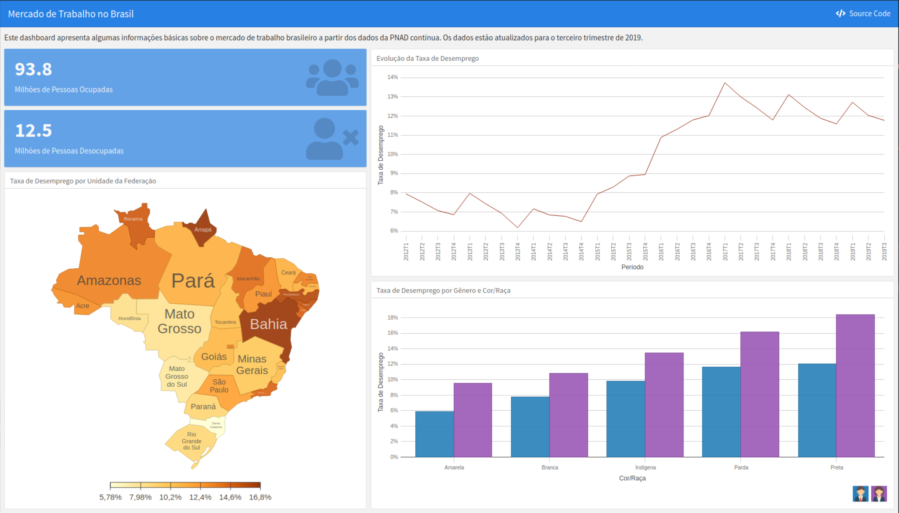

```{r setup, include=FALSE}
knitr::opts_chunk$set(echo = TRUE)
```

## Introdução

Neste post, iremos criar uma dashboard no R. Como dito no resumo, utilizaremos o pacote `flexdashboard`. O pacote está disponível no CRAN. Assim, podemos instalá-lo com o seguinte comando:

```{r, eval=FALSE}
install.packages("flexdashboard")
```
  
Além do flexdashboard, serão utilizados os seguintes pacotes:

```{r}
library(flexdashboard)
library(tidyverse)
# remotes::install_github("paulofelipe/D3plusR")
library(D3plusR)
library(janitor)
```

O `flexdashboard` utiliza a lógica de marcação com os demais documentos que são criados com base no R Markdown. Assim, é necessário um conhecimento mínimo sobre R Markdown para que se possa entender como o `flexdashboard` funciona. Indico a [própria página do R Markdown](https://rmarkdown.rstudio.com/), bem como algo que nós também escrevemos e que está disponível [neste livro](http://cdr.ibpad.com.br/).


## Dados

Os dados utilizados para criar o dashboard são oriundos da PNAD contínua. É possível acessar os microdados da PNAD contínua diretamente pelo R usando o pacote `PNADcIBGE`. Aqui está um excelente tutorial de como usar esse pacote: [Análise de microdados da PNAD Contínua](https://rpubs.com/BragaDouglas/335574). 

O script que escrevi para baixar os dados está disponível [neste link](https://github.com/paulofelipe/dashboard_pnad/blob/master/scripts/baixa_dados.R). Baixei mais dados do que aquilo que foi usado no post. De toda forma, o script fica como exemplo para uso futuro.


## Estrutura do Dashboard

A primeira coisa a ser feita é definir o layout do dashboard. O principal aspecto a ser definido é a orientação. O `flexdashboard` trabalha com duas orientações: linhas (`rows`) ou colunas (`columns`). A [página desse pacote](https://rmarkdown.rstudio.com/flexdashboard/) detalha bem as possibilidades de orientação. Abaixo, temos os layouts básicos:

* Colunas:

](layout_column.png)

* Linhas

](layout_row.png)

As marcações de linhas ou colunas são feitas como:
```markdown
Row
----------------------------------------------

Column
----------------------------------------------
```

Note que no layout em colunas, uma vez que se define uma coluna, as "caixinhas" vão sendo empilhadas (direção vertical). Assim, se dentro de uma marcação de coluna existirem três marcações com "###", teremos três "caixinhas" empilhadas. Dentro de cada marcação do tipo "###", poderemos criar um *chunk* com um código que crie, por exemplo, um gráfico ou uma tabela. Dessa forma, o nosso dashboard estará sendo criado. A mesma lógica vale para o layout de linhas.

A parte vertical do layout pode ser do tipo "fill" ou "scroll". No caso de "fill", o dashboard ocupada exatamente 100% do espaço vertical disponível. No caso de "scroll", é possível criar um dashboard que extrapole o tamanho vertical disponível, sendo criada uma barra de rolagem. 

Além dessas características básicas, é possível criar abas (_tabsets_), múltiplas páginas e _storyboards_, além de aplicações Shiny. A documentação do pacote é bastante clara de como essas funcionalidades podem ser utilizadas. Aqui, vamos nos restringir ao mais simples.


## Criando um dashboard

O dashboard desse exemplo está disponível [neste link](https://paulofelipe.github.io/dashboard_pnad/). O resultado final é esse:

```{r, fig.cap="Exemplo de dashboard", preview = TRUE, echo = FALSE}

```

Uma vez que o `flexdashboard` esteja instalado, é possível criar um arquivo com uma estrutura básico a partir no menu do RStudio. Para isso, vá em _File_ > _New File_ > _R Markdown_. Na caixa de diálogo, vá em _From Template_  e escolha o `flexdashboard`. 


Especificamente para o nosso exemplo, a configuração do dashboard é a seguinte:
```yaml
---
title: "Mercado de Trabalho no Brasil"
output: 
  flexdashboard::flex_dashboard:
    orientation: columns
    vertical_layout: fill
    source_code: embed
---
```

A opção `source_code: embed` cria um link que disponibiliza o código utilizado para gerar o dashboard.

Iniciado nosso dashboard, temos na primeira coluna duas `valuebox` e um gráfico com o mapa do desemprego por Unidade da Federação. Uma `valuebox` é criada de maneira bastante simples. Por exemplo:

```{r, eval=FALSE}
valueBox(value = 100, icon = "fa-users")
```

No argumento `icon`, utilizamos o valor "fa-users". O termo "fa" refere-se a _font awesome_ que é um conjunto de ícones comumente usados em projetos para a web. Para ver os ícones disponíveis, entre [neste site](https://fontawesome.com/v4.7.0/icons/). Para a função `valueBox()` deve ser fornecido "fa-nome-do-icone".

No caso do nosso dashboard, a primeira _valuebox_ foi construída da seguinte forma (o começo do código está disponível no link "source code" do dashboard):

````markdown

Column
---------------------------------------------------------------
### Milhões de Pessoas Ocupadas

`r ''````{r}
totais <- dados_pnad %>% 
  group_by(vd4002) %>%
  summarise(n = round(sum(v1028)/1e6, 1)) %>% 
  na.omit() %>% 
  spread(key = vd4002, value = n) %>% 
  clean_names()

totais %>% 
  pull(pessoas_ocupadas) %>% 
  valueBox(value = ., icon = 'fa-users')
```

### Milhões de Pessoas Desocupadas

`r ''````{r}
totais %>% 
  pull(pessoas_desocupadas) %>% 
  valueBox(value = ., icon = 'fa-user-times')
```
````

Agora, o código que cria o gráfico do mapa do Brasil por UF. Para criação do mapa, utilizei o pacote `D3plusR`. Como não é o foco e para não deixar o post muito longo, não vou entrar em detalhes sobre a criação do gráfico. De toda forma, quem tiver interesse sobre esse pacote, sugiro dar uma lida [neste post](https://www.fulljoin.com.br/posts/2017-03-12-introducao-d3plusr/) e [neste tutorial](https://paulofelipe.github.io/tutorial_d3plusr/).

Note que continuamos com a marcação "###" sem começar uma nova coluna.

````markdown

### Taxa de Desemprego por Unidade da Federação

`r ''````{r}
dados_pnad %>% 
  group_by(uf, v2007, v2010, vd4002) %>%
  summarise(n = sum(v1028)) %>%
  na.omit() %>% 
  ungroup() %>% 
  spread(key = vd4002, value = n) %>% 
  clean_names() %>% 
  replace_na(list(pessoas_desocupadas = 0)) %>% 
  group_by(uf) %>% 
  summarise(
    pessoas_ocupadas = sum(pessoas_ocupadas),
    pessoas_desocupadas = sum(pessoas_desocupadas),
    tx_desemprego = sum(pessoas_desocupadas)/sum(pessoas_desocupadas + pessoas_ocupadas) * 100
  ) %>% 
  arrange(-tx_desemprego) %>% 
  left_join(uf_sigla) %>% 
  d3plus(data = .,
         type = "geo_map",
         locale = "pt_BR",
         percent_var = "tx_desemprego",
         id = "bra_id",
         currency = "US$",
         number_text = c("Mil", "Milhão", "Milhões", "Bilhão", "Bilhões"),
         dictionary = dicionario) %>% 
  d3plusCoords(
   # Crédito do mapa: https://gist.github.com/ruliana/1ccaaab05ea113b0dff3b22be3b4d637
   # url encurtada do topojson de UFs
    value = "https://tinyurl.com/wtpyxsr",
    projection = "equirectangular"
  ) %>% 
  d3plusColor(value = "tx_desemprego",
              heatmap = RColorBrewer::brewer.pal(n = 6, name = "YlOrBr")) %>% 
  d3plusText("uf") %>% 
  d3plusTooltip(value = c("pessoas_ocupadas", "pessoas_desocupadas"))
```

````

Para começar uma nova coluna, basta adicionar a marcação correspondente:

````markdown

Column
---------------------------------------------------------------

````

Dessa forma, vamos completando o nosso dashboard. 

## Conclusão

O objetivo deste post era o de introduzir o pacote flexdashboard. Aqui, apresentamos algumas funcionalidades. No entanto, é importante ressaltar que existem muitas outras possibilidades que não foram apresentadas neste post. É possível usar esse pacote para criar dashboards bastante customizados e de alta qualidade. O ideal é que quem tenha interesse em aprender tente fazer um dashboard a partir de algum projeto pessoal e dê uma estudada na [página do pacote](https://rmarkdown.rstudio.com/flexdashboard/).  

Para ver o código completo do nosso exemplo de dashboard, entre [neste link](https://paulofelipe.github.io/dashboard_pnad/) e clique em "Source Code".


