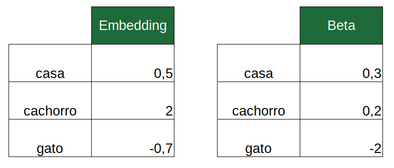

```{r setup, include=FALSE}
knitr::opts_chunk$set(echo = TRUE)
```

## Disclaimer

Este post é uma implementação em R do código já desenvolvido em Python e apresentado neste post: [A Neural Implementation of NBSVM in Keras](https://medium.com/@asmaiya/a-neural-implementation-of-nbsvm-in-keras-d4ef8c96cb7c) - Escrito por: Arun Maya.

Apesar do nome NBSVM, não trabalharemos com o SVM (*support vector machines*) neste post. O nome do modelo faz referência ao paper ["Baselines and Bigrams: Simple, Good Sentiment and Topic Classification"](https://nlp.stanford.edu/pubs/sidaw12_simple_sentiment.pdf) escrito por Sida Wang e Christopher Manning. Os autores testam o modelo SVM com Naive Bayes features que são criadas utilizando o log das razões de contagem. Contudo, costuma-se também usar o modelo de regressão logística no lugar do SVM. Por exemplo: [NB-SVM strong linear baseline](https://www.kaggle.com/jhoward/nb-svm-strong-linear-baseline). 

## Pacotes

```{r}
library(text2vec)
library(tidyverse)
library(keras)
```

## Preparando os Dados

Os dados podem ser baixados [neste link](https://ai.stanford.edu/~amaas/data/sentiment/aclImdb_v1.tar.gz).

Os arquivos estão separados em pastas distintas por conjunto (treino e teste) e sentimento (negativo e positivo). O Código abaixo prepara os dados:

```{r, cache = TRUE}

imdb_path <- '../../dados/aclImdb'

train <- map_df(c("neg", "pos"), ~ {
  idx <- .x
  arquivos <- list.files(
    file.path(imdb_path, "train", idx),
    full.names = TRUE
  )
  map_df(arquivos, ~ {
    tibble(
      review = read_lines(.x)
    ) %>%
      mutate(sentiment = idx)
  })
}) %>%
  # coloca em ordem aleatória
  sample_frac(1)

head(train)

test <- map_df(c("neg", "pos"), ~{
  idx <- .x
  arquivos <- list.files(file.path(imdb_path, "test", idx), full.names = TRUE)
  map_df(arquivos, ~{
    tibble(
      review = read_lines(.x)
    ) %>%
      mutate(sentiment = idx)
  })
})

head(test)

# Adiciona o ID e limpa os textos para deixar apenas letras
train <- train %>%
  mutate(
    id = paste0("train_", 1:n())
  )

test <- test %>%
  mutate(
    id = paste0("test_", 1:n())
  )

dim(train)
dim(test)
```

## Definindo o vocabulário

O código abaixo cria o nosso vocabulário. Isto é, o conjunto de termos que serão considerados pelo modelo. As stopwords, que são palavras que não possuem um significado direto, não foram removidas (de propósito) e consideramos unigramas, bigramas e trigramas. O vocabulário foi limitado a 800.000 termos.

```{r}
vocabulario <- itoken(
  train$review,
  preprocessor = tolower,
  tokenizer = word_tokenizer,
  id = train$id,
  progressbar = FALSE
) %>% 
create_vocabulary(
  it = .,
  ngram = c(1, 3)
) %>% 
prune_vocabulary(
  vocabulary = .,
  vocab_term_max = 800000
)

text_vectorizer <- vocab_vectorizer(vocabulary = vocabulario)

vocabulario
``` 

## Textos para IDs

Nesta parte, iremos converter os nossos textos em matrizes nas quais cada linha representará um texto (um *review*) e haverá N (igual ao valor definido no objeto `max_len` no nosso código) colunas que identificam os termos que aparecem naquele texto. Por exemplo, a primera coluna irá guardar o ID (número de identificação) do primeiro termo, na ordem do vocacabulário, que aparece em cada texto. A segunda coluna, por sua vez, traz o ID do segundo termo. Se o número de termos no texto for inferior a N, utiliza-se o ID 0 nas colunas restantes.

```{r}
text_to_ids <- function(textos, vocabulario, max_len = 128, text_vectorizer) {
  

  tokens <- itoken(
    textos,
    preprocessor = tolower,
    tokenizer = word_tokenizer,
    id = 1:length(textos),
    progressbar = FALSE
  )

  dtm <- create_dtm(
    it = tokens,
    vectorizer = text_vectorizer,
    type = 'dgCMatrix'
  )

  dtm <- 1 * (dtm > 0)  

  TmpX <- as(dtm, "dgTMatrix")

  dtm_df <- data.frame(matrix(c(TmpX@i + 1, TmpX@j + 1), ncol = 2)) %>%
    arrange(X1) %>%
    group_by(X1) %>%
    mutate(n = 1:n()) %>%
    ungroup() %>%
    filter(n <= max_len)

  X <- crossing(
    X1 = unique(dtm_df$X1),
    n = 1:max_len
  ) %>%
    left_join(dtm_df, by = c("X1", "n")) %>%
    replace_na(list(X2 = 0)) %>%
    select(X1, X2)

  X <- matrix(X$X2, ncol = max_len, byrow = TRUE)

  return(X)

}

max_len <- 2048
# Exemplo
text_to_ids(c("awesome movie"), vocabulario, max_len, text_vectorizer)[, 1:10]

# Criando input para os dados de treinamento e teste
xtrain <- text_to_ids(train$review, vocabulario, max_len, text_vectorizer)
xtest <- text_to_ids(test$review, vocabulario, max_len, text_vectorizer)

xtrain[33:40, 56:63]
```
## Calculando as razões de contagem

Neste trecho, calculamos a chance de cada palavra aparecer em uma determinada classe (positivo ou negativo) e computamos o log da razão dessas chances. Essas seriam as features (o valor imputado para cada termo) que deveriam ser utilizadas no modelo SVM como inicialmente proposto em ["Baselines and Bigrams: Simple, Good Sentiment and Topic Classification"](https://nlp.stanford.edu/pubs/sidaw12_simple_sentiment.pdf).

```{r}
train_dtm <- itoken(
  train$review,
  preprocessor = tolower,
  tokenizer = word_tokenizer,
  id = train$id,
  progressbar = FALSE
) %>%
  create_dtm(
    it = .,
    vectorizer = text_vectorizer,
    type = 'dgCMatrix'
  )
  
p <- Matrix::colSums(train_dtm[train$sentiment == "pos", ])
q <- Matrix::colSums(train_dtm[train$sentiment == "neg", ])

p <- (p + 1) / (sum(train$sentiment == "pos") + 1)
q <- (q + 1) / (sum(train$sentiment == "neg") + 1)

nb_ratio <- log(p / q)

nb_ratio[1:4]
```

Por fim, passamos esse vetor para uma matriz que será utilizada para alimentar um camada de *embeddings* do nosso modelo:

```{r}
# adiciona-se o "pad" ao vocabulário
# Tamanho do Vocabulário: 800.001
vocab_size <- nrow(vocabulario) + 1

# O pad (ID 0) fica com a razão definida em 0.
embedding_matrix <- matrix(0, nrow = vocab_size, ncol = 1)
embedding_matrix[-1, ] <- nb_ratio
```

## Definindo o modelo no Keras

O nosso modelo contará com **embeddings**. De forma simplificada, os *embeddings* são utilizados para representar de forma densa, por exemplo, uma palavra. No modelo de *bag-of-words*, um termo é representado por um vetor de tamanho igual ao vocabulário, no qual apenas uma coluna é diferente de zero. Quando se utiliza *embeddings*, pode-se trabalhar com representações consideravelmente menores. Por exemplo, os termos podem ser representados por um vetor de tamanho 100. Ou seja, 100 números representam uma determinada palavra.

No nosso modelo, cada palavra será representada pelo seu valor no vetor `nb_ratio`. Isto é, utilizaremos um vetor de tamanho 1 para representar cada palavra do nosso vocabulário. Os valores desse *embeddings* estarão fixos durante o treinamento.

Adicionalmente, utilizaremos um segundo *embeddings* que representariam os coeficientes de uma regressão logística.

Por fim, computamos o produto escalar (*dot product*) entre esses dois embeddings e passamos o resultado para uma função ativação *sigmoid*.

Por exemplo, suponha que o texto contenha as palavras "casa", "cachorro" e "gato". Os *embeddings* seriam os seguintes:



O produto escalar resultante é:

$$0,5 \times 0,3 + 2 \times 0,2 - 0,7 \times -2 = 1,95$$

Este número resultante será passado para uma camada densa com função de ativação sigmoid:  

$$\frac{1}{1 + \exp{\left(-1,95\right)}}$$

Assim, obtemos um número entre 0 e 1 que será a probabilidade da classe 1 (que será definida como a classe "positivo").

O código abaixo define nosso modelo utilizando o Keras.

```{r}
cria_modelo <- function(lr = 0.001) {
  input <- layer_input(shape = max_len)

  emb_out <- input %>%
    layer_embedding(
      input_dim = vocab_size,
      output_dim = 1,
      input_length = max_len,
      weights = list(embedding_matrix),
      trainable = FALSE
    )

  beta <- input %>%
    layer_embedding(
      input_dim = vocab_size,
      output_dim = 1, 
      embeddings_initializer = "glorot_normal",
      input_length = max_len,
    )

  out <- layer_dot(
    list(emb_out, beta),
    axes = 1
  ) %>%
    layer_flatten() %>%
    layer_activation("sigmoid")

  model <- keras_model(
    input = input,
    out = out
  )

  model %>%
    compile(
      optimizer = optimizer_adam(lr = lr),
      loss = "binary_crossentropy",
      metrics = list("accuracy")
    )

  return(model)
}

model <- cria_modelo(lr = 0.001)
model
```

## Treinando e Avaliando o Modelo

Abaixo, criamos as matrizes de target:

```{r}
ytrain <- train %>%
  select(sentiment) %>% 
  mutate(sentiment = ifelse(sentiment == "pos", 1, 0)) %>% 
  data.matrix()

ytest <- test %>%
  select(sentiment) %>% 
  mutate(sentiment = ifelse(sentiment == "pos", 1, 0)) %>% 
  data.matrix()

head(ytrain)
```

Vamos agora treinar o modelo e avaliar na base de teste:

```{r}
model %>%
  fit(
    xtrain, ytrain,
    batch_size = 32,
    epochs = 3,
    validation_data = list(xtest, ytest)
  )

avaliacao_test <- model %>% evaluate(xtest, ytest)
avaliacao_test
```

O modelo atingiu a acurácia de `r scales::percent(avaliacao_test$accuracy, accuracy = 0.1, big.mark = ".", decimal.mark = ",")`.

É isso que temos para hoje! Qualquer dúvida, crítica ou sugestão é só deixar nos comentários!