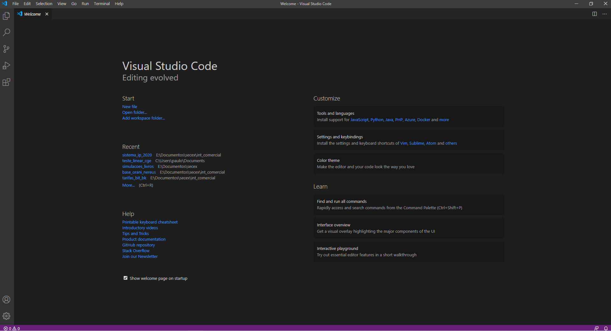
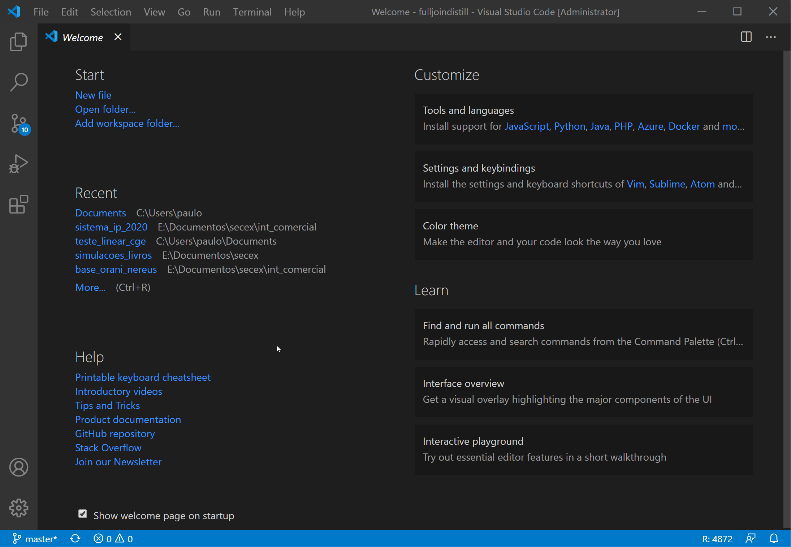
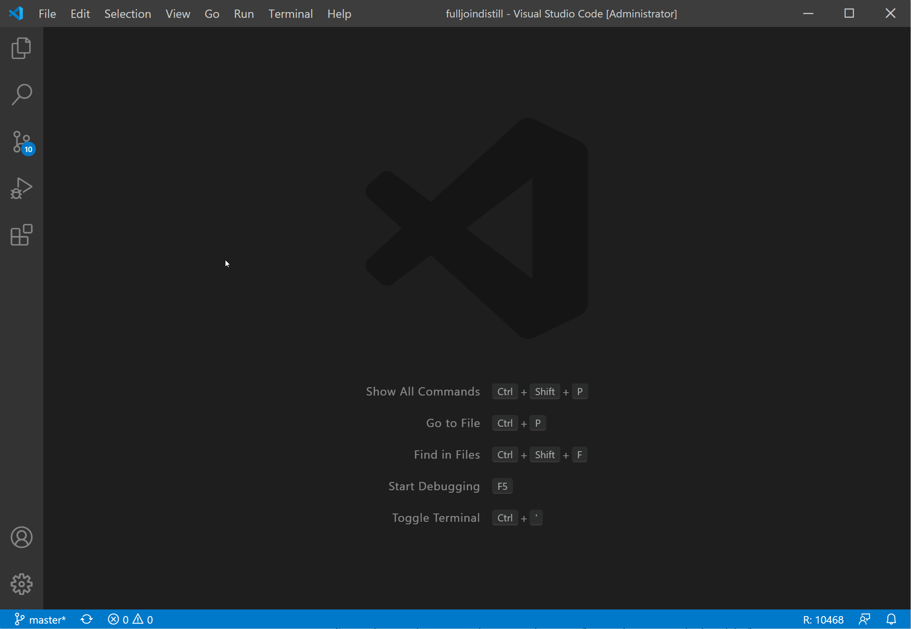
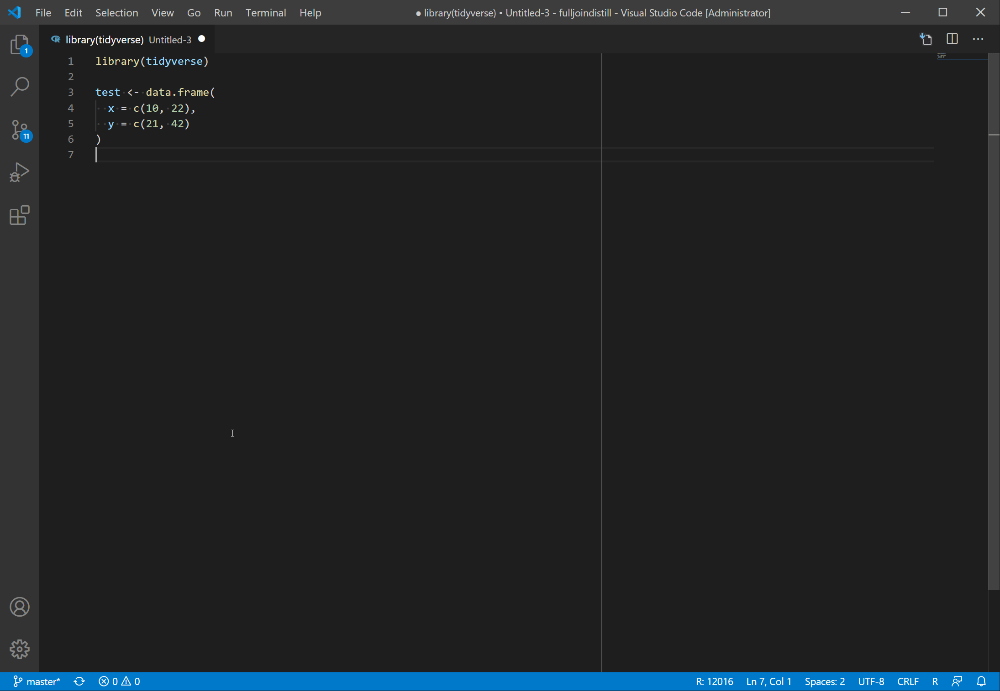

```{r setup, include=FALSE}
knitr::opts_chunk$set(echo = FALSE)
```

## Introdução
Neste post, irei mostra como configurar o VS Code para trabalhar com o R. O VS Code é um dos principais editores de códigos atualmente. Ele conta com uma série de funcionalidades e extensões que facilitam a vida de quem está escrevendo o código.  Quem trabalha com o R, normalmente trabalha com RStudio, que é um ambiente de desenvolvimento totalmente planejado para aumentar a produtividade com o R. 

Sem querer entrar na discussão de quem é melhor ou pior e considerando que as funcionalidade para R no VS code ainda estão em fase de desenvolvimento, o objetivo deste post é apenas apresentar essa outra possibilidade para quem trabalha com o R. Uma das vantagens do VS Code é o amplo conjunto de extensões que podem auxiliar o usuário. Por outro lado, é fato que o RStudio é uma ferramenta bem mais madura para desenvolvimento em R.

O passo a passo da configuração do R para o VS Code será feito para o Windows. Estou assumindo que usuários de Linux conseguem fazer a configuração a partir de instruções gerais.
Por fim, assume-se que o usuário já possui uma instalação de R na sua máquina.

## Instalando o VS Code
O VS Code pode ser instalado [neste link](https://code.visualstudio.com/download) sem maiores dificuldades. Uma vez instalado, você verá o aplicativo da seguinte forma:


 
## Configurando para uso do R
Para usar o R no VS Code, será necessário instalar a extensão “R”. Para isso, você pode:

* digitar `CTRL + SHIFT + X`;
* Ir em `File > Preferences > Extensions`;
* Clicar no ícone com quatro quadrados na barra à esquerda.

Na barra de pequisa, procure por “R” e instale a extensão desenvolvida por Yuki Ueda. Basta clicar em no botão verde “Install”. 

Com a extensão instalada, clique na engrenagem e “Extensions Settings”. No campo, R.exe path for Windows indique o caminho do executável do R no seu computador. Por exemplo, no meu computador, o caminho é: `C:\Program Files\R\R-4.0.2\bin\R.exe`. Mais adiante, irei mostrar como configurar o [Radian]( https://github.com/randy3k/radian), que é um console alternativo para o R.

Outra extensão importante para ser instalada é a “language server” para o R. Nas extensões, procure por “r-lsp” e faça a instalação. Essa extensão pede que voce instale o pacote de R “languageserver”. Pode-se instalar a versão do CRAN ou a de desenvolvimento. Vamos fazer o seguinte:

* Tecle “Ctrl + N” para abrir um novo script;
* No canto direito inferior, clique em “Plain Text” e altere para “R” (também é possível utilizar o atalho “Ctrl + K” e depois tecle “m”;
* Depois escreva “install.packages(“languageserver”)” ou “devtools::install_github("REditorSupport/languageserver")”
* Com o cursor na linha do comando, tecle `Ctrl + Enter` para executar. 



Se por algum motivo ocorrer algum error de permissão negada no momento da instalação, tente abrir o VS Code com permisões de administrador.

Uma vez que você concluiu a instalação desse pacote, clique no ícone de engrenagem da extensão “R LSP Client”. Lá existirão algumas opções. Em Lsp: Path, inclua o caminho para o executável no R (Exemplo: `C:\Program Files\R\R-4.0.2\bin\R.exe.`).

## Testando
Vamos fazer um teste rápido para saber se tudo está funcionando:
 - Crie um novo arquivo (Ctrl + N) e mude a linguagem para o R.
 - Teste o seguinte código:

```{r, echo = TRUE, eval = FALSE}
library(tidyverse)

head(mtcars) %>%
  View()
```



Se o código rodou normalmente, é sinal que tudo funcionou corretamente.

## Adicionando atalhos

Quem usa o RStudio está acostumado, por exemplo, ao atalhos “Alt + -“ e “Ctrl + Shift + m” para, respectivamente, o assignment “<-“ e o pipe “%>%”. Para adicionar esses atalhos no VS Code, faça o seguinte:

 - Clique em View > Command Palette ou tecle o atalho “Ctrl + Shift + P”;
 - Na caixa de busca, procure “Preferences: Open Keyboard Shortcuts (JSON);
 - Cole o seguintes código (você pode adicionar mais atalhos do seu interesse):

```js
// Place your key bindings in this file to override the defaults
[
    {
        "key": "alt+-",
        "command": "type",
        "when": "editorLangId == r || editorLangId == rmd && editorTextFocus",
        "args": { "text": " <- " }
    },
    {
        "key": "ctrl+shift+m",
        "command": "type",
        "when": "editorLangId == r || editorLangId == rmd && editorTextFocus",
        "args": { "text": " %>% " }
    },
    {
        "key": "f1",
        "command": "r.runCommandWithSelectionOrWord",
        "when": "editorTextFocus && editorLangId == 'r'",
        "args": "help($$)"
    },
    {
        "key": "f2",
        "command": "r.runCommandWithSelectionOrWord",
        "when": "editorTextFocus && editorLangId == 'r'",
        "args": "View($$)"
    },
    {
        "key": "alt+ctrl+b",
        "command": "r.runCommand",
        "when": "editorTextFocus && editorLangId == 'r'",
        "args": "carbonate::carbon$new()$browse()"
    }
]
```

## Configurando o Radian

O Radian é um console alternativo para R. O projeto pode ser encontrado no Github [neste link](https://github.com/randy3k/radian). Para usar o radian, é preciso ter uma instalação do Python no seu computador. A maneira mais prática é instalar o pacote `reticulate` do R e usar a função `install_miniconda()`. Considerando que o Python está instalado, o próximo passar é instalar o Radian. 

Nos meus testes, não tive sucesso com as funções `conda_install()` ou `pip_install()`. Por isso, vou mostrar como fazer a instalação a partir do terminal. Primeiramente, ainda no R, veja onde está a sua instalação do miniconda: `reticulate::py_config()`. No meu caso, o endereço é: `C:/Users/paulo/AppData/Local/r-miniconda`.

Agora, siga os seguintes passos:

* No VS Code, clique em `Terminal > New Terminal`;
* Com o terminal aberto, digite {MINICONDA_PATH}/condabin/activate.bat r-reticulate para ativar o environment `r-reticulate`. Note que {MINICONDA_PATH} deve ser substituído pelo caminho do miniconda no seu computador.
* Assumindo que o passo anterior funcionou e que vc esteja com o environment `r-reticulate` ativado, execute o código `pip install -U radian`.
* Execute `radian` no mesmo terminal para verificar que tudo deu certo.

Se tudo deu certo, você precisa indicar o executável do Radian para o VS Code. Para isso, vá em extensões, procure a extensão "R" e entre nas configurações (clique na engrenagem). No `R.exe for Windows`, inclua o caminho para o `radian.exe`. Esse arquivo estará dentro do environment `r-reticulate`. Por exemplo, no meu caso, o caminho é: `C:\Users\paulo\AppData\Local\r-miniconda\envs\r-reticulate\Scripts\radian.exe`.

Feche o VS Code e abra novamente. Se tudo estiver ok, quando você for executar um novo script, o seguinte comportamente deve ser observado:



## Rmarkdown

É possível executar arquivos Rmd no VS Code sem problemas. No entanto, não há, por enquanto, tantas funcionalidades para o Rmarkdown quanto no RStudio. Todavia, em breve haverá avanços nessa parte. Veja [este tweet](https://twitter.com/renkun_ken/status/1299382192624209925) do [`@renkun_ken`](https://twitter.com/renkun_ken).

## Finalizando

Para mais exemplos de uso do VS Code sugiro, novamente, o twitter do [`@renkun_ken`](https://twitter.com/renkun_ken). Ele apresenta uma série de exemplos de funcionalidade que ele implementou ou está implementando. 

Por hoje, era isso. Se você encontrou algum problema ou tem alguma dúvida, por favor deixe um comentário para eu saber como posso expandir esse post. Obrigado!

